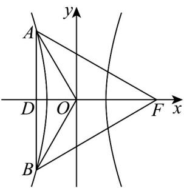

> [!faq]- 《专题11_双曲线标准方程及其性质高频题型精准突破_十大题型__高效培优》官方解析
>
> > [!success]- **【答案】** $\sqrt{3} + 1 / 1 + \sqrt{3}$
>
> > [!note]- **【分析】**
> > 根据给定条件，结合双曲线的对称性可得 $\triangle ABF$ 是正三角形，且 $O$ 是其中心，再用半焦距 $c$ 表示出点 $A$ 坐标，代入双曲线方程求出离心率·
>
> > [!note]- **【解析】**
> > $AB \perp x$ 轴，令垂足为 $D$ ，由双曲线的对称性知 $|BF| = |AF| = |AB|$ ，则 $\triangle ABF$ 是正三角形，
> >
> > 又 $BO \perp AF$ ， $FO \perp AB$ ，则 O 是 $\triangle ABF$ 的中心， $|AO| = |OF| = c$
> >
> > 而 $\angle AOD = 60^{\circ}$ ，则 $|OD| = \frac{1}{2} c, |AD| = \frac{\sqrt{3}}{2} c$ ，点 $A(-\frac{1}{2} c, \frac{\sqrt{3}}{2} c)$ 在双曲线 $C$
> >
> > 因此 $\frac{c^2}{4a^2} -\frac{3c^2}{4b^2} = 1$ ，即 $\frac{c^2}{a^2} -\frac{3c^2}{c^2 - a^2} = 4$ ，整理得 $e^2 -\frac{3e^2}{e^2 - 1} = 4$ ，即 $e^4 -8e^2 +4 = 0$
> >
> > 解得 $e^2 = 4 + 2\sqrt{3} = (\sqrt{3} + 1)^2$ ，所以 $C$ 的离心率 $e = \sqrt{3} + 1$
> >
> > 故答案为： $\sqrt{3} + 1$
> >
> > 
