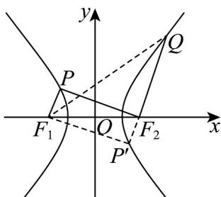

> [!faq]- 《专题11_双曲线标准方程及其性质高频题型精准突破_十大题型__高效培优》官方解析
>
> > [!success]- **【答案】** B
>
> > [!note]- **【分析】**
> > 根据平行关系利用对称性并结合双曲线定义，利用勾股定理构造方程可解得 $\frac{c^2}{a^2} = \frac{29}{9}$ ，可得其离心率·
>
> > [!note]- **【解析】**
> > 连接 $QF_{1}$ ，延长 $QF_{2}$ 与双曲线交于点 $P'$ ，连接 $F_{1}P'$ ，如下图所示：
> >
> > 
> >
> > 由 $F_{1}P \parallel F_{2}Q$ ，根据对称性可知 $\left|F_{1}P\right|=\left|F_{2}P'\right|$ ，又 $PF_{1} \perp PF_{2}$ ，所以四边形 $PF_{1}P'F_{2}$ 为矩形；
> > 由 $\left|F_{2}Q\right|=2\left|F_{2}P\right|$ 可设 $\left|F_{2}P\right|=m(m>0)$ ，则 $\left|F_{2}Q\right|=2m$ ;
> >
> > 由双曲线定义可知 $\left|F_{2}P\right|-\left|F_{1}P\right|=2a$ ，所以 $\left|F_{1}P\right|=m-2a$ ，所以 $\left|F_{1}P\right|=\left|F_{2}P'\right|=m-2a$ ；
> >
> > 又 $\left|F_{1}Q\right|-\left|F_{2}Q\right|=2a$ ，所以 $\left|F_{1}Q\right|=2m+2a$ ；
> >
> > 因为 $\left|QP'\right| = \left|QF_2\right| + \left|P'F_2\right| = 2m + m - 2a = 3m - 2a$
> >
> > 在 $\triangle F_{1}QP^{\prime}$ 中， $\left|QP^{\prime}\right|^{2} + \left|P^{\prime}F_{1}\right|^{2} = \left|QF_{1}\right|^{2}$ ，且 $\left|F_{2}P\right| = \left|P^{\prime}F_{1}\right| = m$
> >
> > 所以 $(3m-2a)^{2}+m^{2}=(2m+2a)^{2}$ ，解得 $m=\frac{10}{3}a$ ；
> >
> > 即 $\left|F_{2}P\right|=m=\frac{10}{3}a$ ，所以 $\left|F_{1}P\right|=\frac{10}{3}a-2a=\frac{4}{3}a$ ；
> >
> > 在 $\triangle F_{1}PF_{2}$ 中， $\left|PF_{1}\right|^{2} + \left|PF_{2}\right|^{2} = \left|F_{2}F_{1}\right|^{2}$ ，即 $\left(\frac{10}{3} a\right)^{2} + \left(\frac{4}{3} a\right)^{2} = (2c)^{2}$ ，
> >
> > 解得 $\frac{c^2}{a^2} = \frac{29}{9}$ ，即 $e = \sqrt{\frac{c^2}{a^2}} = \sqrt{\frac{29}{9}} = \frac{\sqrt{29}}{3}$
> >
> > 故选 **B**
