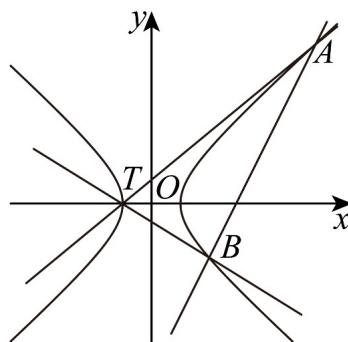

> [!faq]- 《专题11_双曲线标准方程及其性质高频题型精准突破_十大题型__高效培优》官方解析
>
> > [!success]- **【答案】** (1) $\left(\sqrt{2},1\right)$ 或 $(- \sqrt{2},-1)$ (2) $x^{2}-y^{2}=4(y\neq0)\quad x^{2}-y^{2}=4n(y\neq0)$ (3)证明见解析
>
> > [!note]- **【分析】**
> > （1）联立得 $\left\{ \begin{array}{l} y = \sqrt{2} x + m \\ x^2 - y^2 = 1 \end{array} \right.$ ，再根据有唯一公共点 $\Delta = 4m^2 - 4 = 0$ ，解得 $m = \pm 1$ ，再代入方程求点 $P$ 坐标即可；
> >
> > (2) 根据直线与曲线由唯一公共点求出 $m$ 与 $k$ 的关系，再根据过点 $M$ 且与直线 $l$ 垂直的直线分别交 $x$ 轴， $y$ 轴求出 $A, B$ 点坐标及轨迹方程；
> >
> > (3) 设 $l_{AB}: x = my + 6$ ， $A(x_{1}, y_{1}), B(x_{2}, y_{2})$ ，联立得到 $y_{1} + y_{2} = \frac{-12m}{m^{2} - 1}, y_{1}y_{2} = \frac{32}{m^{2} - 1}$ ，再计算
> >
> > $k_{TA}k_{TB}=\frac{y_{1}}{x_{1}+2}\cdot\frac{y_{2}}{x_{2}+2}$ 即可判断.
>
> > [!note]- **【解析】**
> > （ $^{1}$ ）根据题意，
> >
> > 则 $\left\{ \begin{array}{l} y = \sqrt{2} x + m \\ x^2 - y^2 = 1 \end{array} \right.$ ，∴ $x^2 + 2\sqrt{2} mx + m^2 + 1 = 0$
> >
> > $\therefore k \neq \pm 1, \therefore \Delta = (2\sqrt{2} m)^{2} - 4(m^{2} + 1) = 4m^{2} - 4 = 0,$
> >
> > 解得 $m = \pm 1$ ，
> >
> > 当 $m = -1$ 时， $y = \sqrt{2} x - 1$ ， $x^2 - 2\sqrt{2} x + 2 = 0$
> >
> > 解得 $x = \sqrt{2}$ ，此时 $P\left(\sqrt{2}, 1\right)$ ，
> >
> > 当 m=1 时， $y=\sqrt{2}x+1$ ， $x^{2}+2\sqrt{2}x+2=0$ ，
> >
> > 解得 $x = -\sqrt{2}$ ，此时 $P(-\sqrt{2}, - 1)$
> >
> > 当 $k = \sqrt{2}$ 时，点 P 的坐标为 $(\sqrt{2}, 1)$ 或 $(- \sqrt{2}, -1)$ ;
> >
> > (2) $\left\{ \begin{array}{l} y = kx + m \\ x^2 - y^2 = 1 \end{array} \right.$ , $\therefore (1 - k^2)x^2 - 2kmx - m^2 - 1 = 0$
> >
> > $\because k \neq \pm 1, \therefore \Delta = (2km)^{2} + 4(1 - k^{2})(m^{2} + 1) = 0$ ，即 $m^{2} = k^{2} - 1$
> >
> > 故 $P\left(\frac{km}{1 - k^2},\frac{m}{1 - k^2}\right)$ ，即 $P\left(-\frac{k}{m}, - \frac{1}{m}\right)$ ，其中 $km\neq 0$
> >
> > 故过点 $P$ 且与直线 $l$ 垂直的直线为 $y + \frac{1}{m} = -\frac{1}{k}\left(x + \frac{k}{m}\right)$
> >
> > 可得 $M\left(-\frac{2k}{m},0\right),N\left(0, - \frac{2}{m}\right)$ ， $\therefore Q\left(-\frac{2k}{m}, - \frac{2}{m}\right)$
> >
> > $\therefore x = -\frac{2k}{m}, y = -\frac{2}{m}, \therefore x^2 - y^2 = \frac{4k^2 - 4}{m^2} = 4,$
> >
> > 故点 $Q$ 的轨迹方程为 $x^{2} - y^{2} = 4(y \neq 0)$
> >
> > 其轨迹为：双曲线（去掉两个顶点），
> >
> > 如果推广到一般的等轴双曲线，点Q的轨迹方程为 $x^{2}-y^{2}=4n(y\neq0)$ .
> >
> > (3) 证明：由题可知直线 AB 的斜率不为零，设 $l_{AB}: x = my + 6$ ， $A(x_{1}, y_{1}), B(x_{2}, y_{2})$
> >
> > $$
> > \left\{ \begin{array}{l} x ^ {2} - y ^ {2} = 4 (y \neq 0) \\ x = m y + 6 \end{array} , \left(m ^ {2} - 1\right) y ^ {2} + 1 2 m y + 3 2 = 0, \right.
> > $$
> >
> > $$
> > m ^ {2} - 1 \neq 0, m \neq \pm 1, \Delta = (1 2 m) ^ {2} - 1 2 8 (m ^ {2} - 1) = 1 6 m ^ {2} + 1 2 8 > 0
> > $$
> >
> > $$
> > y _ {1} + y _ {2} = \frac {- 1 2 m}{m ^ {2} - 1}, y _ {1} y _ {2} = \frac {3 2}{m ^ {2} - 1},
> > $$
> >
> > $x_{1} + x_{2} = m(y_{1} + y_{2}) + 12 = \frac{-12}{m^{2} - 1} >0$ ，解得 $-1 <   m <   1$
> >
> > $$
> > x _ {1} x _ {2} = (m y _ {1} + 6) (m y _ {2} + 6) = m ^ {2} y _ {1} y _ {2} + 6 m (y _ {1} + y _ {2}) + 3 6 = \frac {- 4 m ^ {2} - 3 6}{m ^ {2} - 1},
> > $$
> >
> > $$
> > k _ {T A} k _ {T B} = \frac {y _ {1}}{x _ {1} + 2} \cdot \frac {y _ {2}}{x _ {2} + 2} = \frac {y _ {1} y _ {2}}{x _ {1} x _ {2} + 2 (x _ {1} + x _ {2}) + 4}
> > $$
> >
> > $$
> > = \frac {3 2}{- 4 m ^ {2} - 3 6 - 2 4 + 4 m ^ {2} - 4} = - \frac {1}{2},
> > $$
> >
> > 所以直线 TA 和直线 TB 的斜率乘积为定值.
> >
> > 
