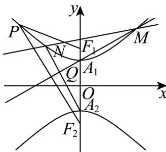

> [!faq]- 《专题11_双曲线标准方程及其性质高频题型精准突破_十大题型__高效培优》官方解析
>
> > [!success]- **【答案】** (1) $\frac{y^{2}}{4}-\frac{x^{2}}{16}=1$ (2) $\left|PF_{2}\right|=3\sqrt{3}+4$ (3)证明见解析
>
> > [!note]- **【分析】**
> > （1）设出点 $P$ ，借助双曲线方程及两点间距离公式计算可得 $y_{P} = a$ 时， $\left|PF_1\right|$ 取最小值，从而可得双曲线方程；
> >
> > (2) 结合双曲线定义计算即可得；
> >
> > (3) 设出直线 $MN$ 的方程后联立曲线，可得与交点横坐标有关韦达定理，再表示出直线 $MA_{1}$ 与直线 $NA_{2}$ 的方程后，联立两直线方程计算即可得解.
>
> > [!note]- **【解析】**
> > （1）设双曲线 $E$ 的标准方程为 $\frac{y^2}{a^2} -\frac{x^2}{b^2} = 1(a > 0,b > 0)$ ，点 $P(x_0,y_0)$
> >
> > 则有 $\frac{y_0^2}{a^2} -\frac{x_0^2}{b^2} = 1$ ，即 $x_0^2 = \frac{b^2y_0^2}{a^2} -b^2$ ，由 $F_{1}\left(0,2\sqrt{5}\right)$ ，则 $a^2 +b^2 = c^2 = 20$
> >
> > $$
> > \left| P F _ {1} \right| = \sqrt {x _ {0} ^ {2} + \left(y _ {0} - 2 \sqrt {5}\right) ^ {2}} = \sqrt {\frac {2 0}{a ^ {2}} y _ {0} ^ {2} - 4 \sqrt {5} y _ {0} + 2 0 - b ^ {2}}
> > $$
> >
> > $$
> > = \sqrt {\frac {2 0}{a ^ {2}} y _ {0} ^ {2} - 4 \sqrt {5} y _ {0} + a ^ {2}} = \sqrt {\left(\frac {2 \sqrt {5}}{a} y _ {0} - a\right) ^ {2}} = \left| \frac {2 \sqrt {5}}{a} y _ {0} - a \right|,
> > $$
> >
> > 由 $y_0 \in (-\infty, -a] \cup [a, +\infty)$ ， $a < 2\sqrt{5}$ ，故 $\left|PF_1\right|_{\min} = 2\sqrt{5} - a$
> >
> > 当且仅当 $y_0 = a$ 时取等号，则 $2\sqrt{5} - a = 2\sqrt{5} - 2$ ，即 $a = 2$ ，
> >
> > 则 $b^{2}=c^{2}-a^{2}=20-4=16$ ，故双曲线 E 的标准方程为 $\frac{y^{2}}{4}-\frac{x^{2}}{16}=1$ ；
> >
> > (2) 由双曲线的定义可得 $\left|PF_{1}\right|-\left|PF_{2}\right|=2a=4$
> >
> > 又 $\left|PF_{1}\right|=3\sqrt{3}$ ，则有 $\left|PF_{2}\right|=3\sqrt{3}-4$ 或 $3\sqrt{3}+4$ ，
> >
> > 由（1）得 $\left|PF_{2}\right|$ $2\sqrt{5}-2$
> >
> > 又 $3\sqrt{3} - 4 - (2\sqrt{5} - 2) = 3\sqrt{3} - 2 - 2\sqrt{5} < 0$ ，所以 $\left|PF_2\right| = 3\sqrt{3} + 4$ ；
> >
> > (3) 由 (1) 可得 $A_{1}(0,2)$ , $A_{2}(0,-2)$ , 设 $M(x_{1},y_{1})$ , $N(x_{2},y_{2})$
> >
> > 显然直线的斜率存在，所以设直线 $MN$ 的方程为 $y = kx + 4$ ，显然 $k\in \left(-\frac{1}{2},\frac{1}{2}\right)$
> >
> > 联立 $\left\{ \begin{array}{l} y = kx + 4 \\ \frac{y^2}{4} - \frac{x^2}{16} = 1 \end{array} \right.$ ，消去有 $y$ （ $4k^2 - 1)x^2 + 32kx + 48 = 0$ ， $\Delta = 64(4k^2 + 3) > 0$ ，
> >
> > 则 $x_{1} + x_{2} = \frac{-32k}{4k^{2} - 1}, x_{1}x_{2} = \frac{48}{4k^{2} - 1}$
> >
> > 直线 $MA_{1}$ 的方程为： $y - 2 = \frac{y_1 - 2}{x_1} \cdot x$ ，直线 $NA_{2}$ 的方程为： $y + 2 = \frac{y_2 + 2}{x_2} \cdot x$
> >
> > $$
> > \frac {y - 2}{y + 2} = \frac {x _ {2} (y _ {1} - 2)}{x _ {1} (y _ {2} + 2)} = \frac {x _ {2} (k x _ {1} + 2)}{x _ {1} (k x _ {2} + 6)} = \frac {k x _ {1} x _ {2} + 2 x _ {2}}{k x _ {1} x _ {2} + 6 x _ {1}}
> > $$
> >
> > $$
> > = \frac {- \frac {3}{2} \left(x _ {1} + x _ {2}\right) + 2 x _ {2}}{- \frac {3}{2} \left(x _ {1} + x _ {2}\right) + 6 x _ {1}} = \frac {- \frac {3}{2} x _ {1} + \frac {1}{2} x _ {2}}{\frac {9}{2} x _ {1} - \frac {3}{2} x _ {2}} = - \frac {1}{3}
> > $$
> >
> > 由 $\frac{y - 2}{y + 2} = -\frac{1}{3}$ 可得 $y = 1$ ，即 $y_{Q} = 1$ ，故点 $Q$ 在定直线 $y = 1$ 上
> >
> > 
