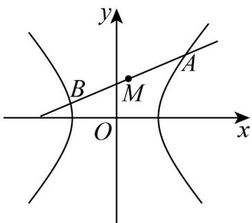

> [!faq]- 《专题11_双曲线标准方程及其性质高频题型精准突破_十大题型__高效培优》官方解析
>
> > [!success]- **【答案】** (1) $\frac{x^{2}}{4}-\frac{y^{2}}{16}=1$ (2) $2x - 3y + 16 = 0$
>
> > [!note]- **【分析】**
> > （1）由题意可得 $\left\{ \begin{array}{l} 2c = 4\sqrt{5} \\ \frac{b}{a} = 2 \\ c^2 = a^2 + b^2 \end{array} \right.$ ，进而求解即可；
> >
> > (2) 分直线斜率不存在和存在两种情况，结合点差法求解即可·
>
> > [!note]- **【解析】**
> > （1）由题意知， $\left\{\begin{aligned}&2c=4\sqrt{5}\\ &\frac{b}{a}=2\\ &c^{2}=a^{2}+b^{2}\end{aligned}\right.$
> >
> > 解得 $a^2 = 4, b^2 = 16, c^2 = 20$ ，故双曲线 $C$ 的方程为 $\frac{x^2}{4} - \frac{y^2}{16} = 1$ .
> >
> > (2) ①当过点 $M(1,6)$ 的直线斜率不存在时，若点 $M$ 为 $AB$ 的中点，则点 $M$ 必在 $x$ 轴上，这与 $M(1,6)$ 矛盾；
> > - **②**：当过点 $M(1,6)$ 的直线斜率存在时，设斜率为 $k(k \neq 0)$ ，则直线方程为 $y - 6 = k(x - 1)$ ，设 $A(x_{1},y_{1}), B(x_{2},y_{2})$ ，因为点 $M(1,6)$ 为线段 $AB$ 的中点，所以 $x_{1} + x_{2} = 2, y_{1} + y_{2} = 12$ ，因为 $A, B$ 在双曲线 $\frac{x^{2}}{4} - \frac{y^{2}}{16} = 1$ 上，所以 $\left\{ \begin{array}{l} 4x_{1}^{2} - y_{1}^{2} = 16 \\ 4x_{2}^{2} - y_{2}^{2} = 16 \end{array} \right.$ ，则 $4(x_{1} - x_{2})(x_{1} + x_{2}) + (y_{2} - y_{1})(y_{2} + y_{1}) = 0$ ，所以 $k = \frac{y_{2} - y_{1}}{x_{2} - x_{1}} = \frac{4(x_{2} + x_{1})}{y_{2} + y_{1}} = \frac{8}{12} = \frac{2}{3}$ ，则所求直线方程为 $y - 6 = \frac{2}{3}(x - 1)$ ，即 $2x - 3y + 16 = 0$ 。
> >
> > 经检验此时直线与双曲线有两个交点，满足题意·
> >
> > 
> >
> > 53. 双曲线 $C: x^2 - \frac{y^2}{3} = 1$ 的左焦点为 $F_1$ .
> >
> > (1) 点 $P$ 在双曲线上，求 $\left|PF_1\right|$ 的最小值（请写出必要推导过程）；
> >
> > (2)过点 $F_{1}$ 作倾斜角为 $\frac{\pi}{6}$ 的直线 $l$ 与 $C$ 交于 $A, B$ 两点，求 $\left|AB\right|$ .
> >
> > 【答案】(1)1
> >
> > (2)3
> >
> > 【分析】（1）设 $P(m,n)$ ，得到 $\left|PF_1\right| = \sqrt{4\left(m + \frac{1}{2}\right)^2}$ ，结合 $m\leq -1,m$ 1即可求解；
> >
> > (2) 根据直线的倾斜角求得斜率，进而根据点斜式写出直线的方程，与双曲线联立，结合韦达定理以及弦长公式即可求解。
> >
> > 【详解】（1）由题可知， $F_{1}(-2,0)$ ，
> >
> > 设 $P(m,n)$ ，则 $m^2 -\frac{n^2}{3} = 1$ ，即 $n^2 = 3m^2 -3(m\leq -1$ 或 $m = 1)$
> >
> > $$
> > \left| P F _ {1} \right| = \sqrt {(m + 2) ^ {2} + n ^ {2}} = \sqrt {m ^ {2} + 4 m + 4 + 3 m ^ {2} - 3}
> > $$
> >
> > $$
> > = \sqrt {4 m ^ {2} + 4 m + 1} = \sqrt {4 \left(m + \frac {1}{2}\right) ^ {2}}
> > $$
> >
> > 又 $m \leq -1$ 或 m 1，所以 m = -1 时， $\left|PF_{1}\right|$ 取得最小值 1；
> >
> > (2) 双曲线 $x^{2} - \frac{y^{2}}{3} = 1$ 的左焦点 $F_{1}(-2,0)$ ，又因为直线 $l$ 的倾斜角为 $\frac{\pi}{6}$ ，所以 $k = \frac{\sqrt{3}}{3}$
> >
> > 则直线 $l$ 的方程为 $y = \frac{\sqrt{3}}{3} (x + 2)$
> >
> > 联立直线方程与双曲线方程 $\left\{ \begin{array}{l}x^{2} - \frac{y^{2}}{3} = 1\\ y = \frac{\sqrt{3}}{3}(x + 2) \end{array} \right.$ ，得 $8x^{2} - 4x - 13 = 0$
> >
> > 设，则 $\left\{ \begin{array}{l}x_{1} + x_{2} = \frac{1}{2}\\ x_{1}x_{2} = -\frac{13}{8}\\ \Delta = (-4)^{2} - 4\times 8\times (-13) > 0 \end{array} \right.$
> >
> > 则 $\left|AB\right|=\sqrt{1+\left(\frac{\sqrt{3}}{3}\right)^{2}}\times\sqrt{\left(\frac{1}{2}\right)^{2}-4\times\left(-\frac{13}{8}\right)}=\sqrt{\frac{4}{3}}\times\sqrt{\frac{27}{4}}=\sqrt{9}=3$
