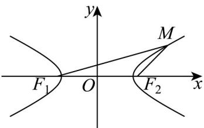
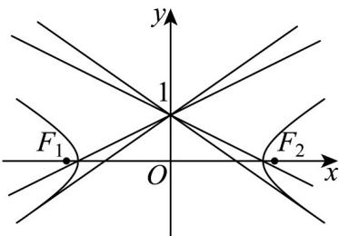

> [!faq]- 《专题11_双曲线标准方程及其性质高频题型精准突破_十大题型__高效培优》官方解析
>
> > [!success]- **【答案】** (1) $\frac{x^{2}}{4}-y^{2}=1$ (2) $\pm\frac{1}{2}$ 或 $\pm\frac{\sqrt{2}}{2}$
>
> > [!note]- **【分析】**
> > （1）根据双曲线的定义求解·
> >
> > （2）设直线 $l$ 的方程为 $y = kx + 1$ ，直线方程代入双曲线方程后分类讨论结合直线与双曲线有且只有一个公共点，计算 $k$ 的值.
>
> > [!note]- **【解析】**
> > （1）已知点 $F_{1}\left(-\sqrt{5},0\right)$ ， $F_{2}\left(\sqrt{5},0\right)$ ， $F_{1}F_{2}=2\sqrt{5}$ ，
> >
> > 则 $\left|MF_1\right| - \left|MF_2\right| = 4 < \left|F_1F_2\right|$ ，由双曲线定义可知，
> >
> > 点 M 的轨迹为焦点在 x 轴上的双曲线，
> >
> > 实轴长为 $2a = 4, a = 2$ ，焦距为 $2c = 2\sqrt{5}, c = \sqrt{5}$ ，因为 $b^2 = c^2 - a^2 = 5 - 4 = 1, b = 1$
> >
> > 所以点 $M$ 的轨迹方程为 $\frac{x^2}{4} - y^2 = 1$ ；
> >
> > 
> >
> > (2) 过点 $(0,1)$ 且斜率为 k 的直线 l 方程为 $y = kx + 1$
> >
> > 代入双曲线方程得： $\frac{x^2}{4} - (kx + 1)^2 = 1 \Rightarrow \left(\frac{1}{4} - k^2\right)x^2 - 2kx - 2 = 0$
> >
> > 当二次项系数为 0 时，即 $\frac{1}{4} - k^2 = 0 \Rightarrow k = \pm \frac{1}{2}$ ，方程为 $-2kx - 2 = 0$ ，有唯一解，
> >
> > 此时直线平行于双曲线的渐近线，与双曲线相交于一点·
> >
> > 当二次项系数不为 0 时，即 $k \neq \pm \frac{1}{2}$ ，需判别式 $\Delta = (-2k)^2 - 4 \times \left(\frac{1}{4} - k^2\right) \times (-2) = 0$
> >
> > 化简得 $2 - 4k^{2} = 0$ ，解得 $k = \pm \frac{\sqrt{2}}{2}$ ，此时直线与双曲线相切，有唯一公共点
> >
> > 综上，实数 $k$ 的值为 $\pm \frac{1}{2}$ 或 $\pm \frac{\sqrt{2}}{2}$ .
> >
> > 
