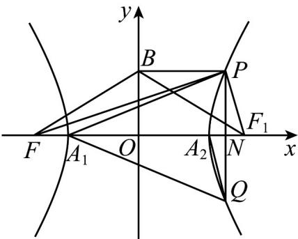

> [!faq]- 《专题11_双曲线标准方程及其性质高频题型精准突破_十大题型__高效培优》官方解析
>
> > [!success]- **【答案】** BCD
>
> > [!note]- **【分析】**
> > 由题意画出图形，结合双曲线定义及三角形两边之和大于第三边列式求解可判断 A；得$k_{A_{1}Q}\cdot k_{PA_{2}}=-1$ 可判断 B； $\sin\angle QPA_{1}=\frac{|A_{1}N|}{|PA_{1}|}=\frac{\sqrt{a+x}}{\sqrt{2x}}$ ， $\sin\angle QA_{2}A_{1}=\sin\angle QA_{2}N=\frac{\sqrt{a+x}}{\sqrt{2x}}$ ，可判断 C；假设 $4|PB|\sqrt{6}|PQ|$ 成立，可得 $(y-2b)^{2}$ 0，可判断 D．
>
> > [!note]- **【解析】**
> > 由题意， $F(-c,0)$ ， $B(0,b)$ ，设右焦点为 $F_{1}(c,0)$ ，
> >
> > 由双曲线定义知， $\left|PF\right|-\left|PF_{1}\right|=2a$ ，则 $\left|PF\right|=2a+\left|PF_{1}\right|$ ，
> >
> > $\because |BP| + |PF_1|, BF_1|, \therefore |BP| + |PF| = |BP| + |PF_1| + 2a, BF_1| + 2a = \sqrt{b^2 + c^2} + 2a$
> >
> > $$
> > \therefore \sqrt {b ^ {2} + c ^ {2}} + 2 a = (\sqrt {3} + 2) a
> > $$
> >
> > 即 $b^{2} + c^{2} = 3a^{2}$ ， $\therefore c^2 -a^2 +c^2 = 3a^2$
> >
> > 
> >
> > $\therefore c^{2} = 2a^{2}$ ，即 $e = \frac{c}{a} = \sqrt{2}, (e > 1)$ ，故A不正确.
> >
> > 设 $P(x,y)$ ， $Q(-x, - y)$ ， $A_{1}(-a,0)$ ， $A_{2}(a,0)$
> >
> > $$
> > \therefore k _ {P A _ {2}} = \frac {y}{x - a}, k _ {A _ {1} Q} = \frac {- y}{x + a}, \therefore k _ {A _ {1} Q} \cdot k _ {P A _ {2}} = \frac {- y}{x + a} \times \frac {y}{x - a} = - \frac {y ^ {2}}{x ^ {2} - a ^ {2}},
> > $$
> >
> > 由 A 可得双曲线方程为 $x^{2}-y^{2}=a^{2}$ ，∴ $k_{A_{1}Q} \cdot k_{PA_{2}} = -1$ ，∴ $PA_{2} \perp A_{1}Q$ ，故 B 正确；
> >
> > 记 $PQ$ 交 $x$ 轴于点 $N$ ， $\sin \angle QPA_{1} = \frac{|A_{1}N|}{|PA_{1}|} = \frac{a + x}{\sqrt{(a + x)^{2} + y^{2}}} = \frac{a + x}{\sqrt{2x^{2} + 2ax}} = \frac{\sqrt{a + x}}{\sqrt{2x}}$
> >
> > $\sin \angle QA_{2}A_{1} = \sin \angle QA_{2}N = \frac{|y|}{\sqrt{(x - a)^{2} + y^{2}}} = \frac{\sqrt{(x - a)(x + a)}}{\sqrt{2x(x - a)}} = \frac{\sqrt{a + x}}{\sqrt{2x}}$
> >
> > $\therefore \sin \angle QPA_{1} = \sin \angle QA_{2}A_{1}$ ，故C正确；
> >
> > 假设 $4|PB|\sqrt{6}|PQ|$ 成立，则只需 $4\sqrt{x^2 + (y - b)^2}\sqrt{6} \times 2|y|$ ，
> >
> > 两边平方得， $16[x^{2}+(y-b)^{2}]$ $24y^{2}$
> >
> > $\therefore 2x^{2} + 2y^{2} - 4by + 2b^{2}\quad 3y^{2},\quad \therefore y^{2} - 4by + 2a^{2} + 2b^{2}\quad 0,$
> >
> > $\therefore (y - 2b)^{2} = 0$ ，当 $y = 2b$ 时取等号，显然成立，故 ${}^{\mathrm{D}}$ 正确；
> >
> > 故选 **BCD**。
