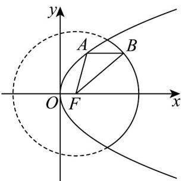

<!-- question-source:start -->
13. 如图所示点 $F$ 是抛物线 $y^{2} = 4x$ 的焦点，点 $A$ 、 $B$ 分别在抛物线 $y^{2} = 4x$ 及圆 $(x - 1)^{2} + y^{2} = 4$ 的实线部分上运动，且 $AB$ 总是平行于 $x$ 轴，则 $\triangle FAB$ 的周长的取值范围是 \_\_\_\_。

<!-- question-source:end -->

![[高中/课堂同步/题库/人教A版高中数学同步讲义(2026)/04_选择性必修第二册/期末/专项训练/专题12_抛物线标准方程及其性质高频题型精准突破_八大题型__高效培优/_compact/answers/Q00060931A1.md]]
