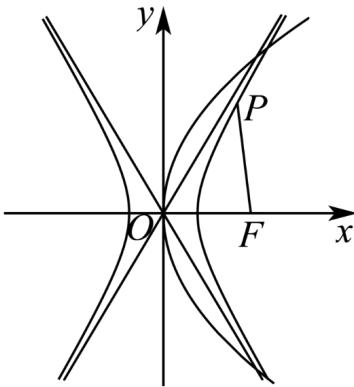

> [!faq]- 《专题12_抛物线标准方程及其性质高频题型精准突破_八大题型__高效培优》官方解析
>
> > [!success]- **【答案】** ACD
>
> > [!note]- **【分析】**
> > 根据双曲线 $C_2$ 的方程求出离心率可判断 $\mathsf{A}$ ；求出双曲线 $C_2$ 的渐近线方程可判断 $\mathsf{B}$ ；由 $C_1, C_2$ 有相同的焦点求出 $m$ 可判断 $\mathsf{C}$ ；点 $P$ 坐标代入 $C_1$ 方程可判断 $\mathsf{D}$ ：
>
> > [!note]- **【解析】**
> > 双曲线 $C_2: x^2 - \frac{y^2}{3} = 1$ 的焦点为 $(2,0)$ ， $(-20)$ ， $a^2 = 1, b^2 = 3$ ，
> >
> > 对于 $\mathsf{A}$ ，双曲线 $C_2$ 的离心率 $e = \frac{\sqrt{1 + 3}}{1} = 2$ ，故 $\mathsf{A}$ 正确；
> >
> > 对于 $\mathsf{B}$ ，双曲线 $C_2$ 的渐近线方程为 $y = \pm \sqrt{3} x$ ，故 $\mathsf{B}$ 错误；
> >
> > 对于 $C$ ，由 $C_1, C_2$ 有相同的焦点，得 $\frac{m}{4} = 2$ ，解得 $m = 8$ ，故 $C$ 正确；
> >
> > 对于 D，由 C 可知，抛物线 $C_{1}: y^{2} = 8x$ 的焦点为 $(2,0)$ ，
> >
> > 因为点 $P(2, y_0)$ 在 $C_1$ 上，所以 $y_0^2 = 8 \times 2$
> >
> > 解得 $y_0 = \pm 4$ ，故 $P(2,4)$ 或 $P(2, - 4)$
> >
> > 所以点 P 到 $C_{1}$ 的焦点 $(2,0)$ 的距离为 4，故 D 正确。
> >
> > 故选：ACD
> >
> > 
