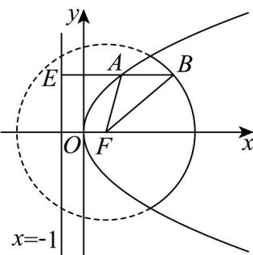

> [!faq]- 《专题12_抛物线标准方程及其性质高频题型精准突破_八大题型__高效培优》官方解析
>
> > [!success]- **【答案】** (4,6)
>
> > [!note]- **【分析】**
> > 过点 A 作准线 x = -1 的垂线，垂足为 E，则 $\triangle FAB$ 的周长为 $x_{B} + 3$ ，求出 $x_{B}$ 后可得所求的范围。
>
> > [!note]- **【解析】**
> > 过点 A 作准线 x = -1 的垂线，垂足为 E，
> >
> > 则 $\triangle FAB$ 的周长为 $|AF| + |AB| + |BF| = |AE| + |AB| + 2 = |BE| + 2 = x_B + 3$ ，由 $\left\{ \begin{array}{l} y^2 = 4x \\ (x - 1)^2 + y^2 = 4 \end{array} \right.$ 可得： $\left\{ \begin{array}{l} x = 1 \\ y = \pm 2 \end{array} \right.$ ，所以 $1 < x_B < 3$ ，故 $\triangle FAB$ 的周长的取值范围为 $(4,6)$ 故答案为： $(4,6)$
> >
> > 
