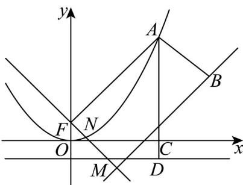

> [!faq]- 《专题12_抛物线标准方程及其性质高频题型精准突破_八大题型__高效培优》官方解析
>
> > [!success]- **【答案】** B
>
> > [!note]- **【分析】**
> > 把问题转化成抛物线上的点到焦点的距离与到定直线的距离之和的最小值问题，再结合抛物线的定义求解·
>
> > [!note]- **【解析】**
> > 如图：
> >
> > 
> >
> > 根据题意， $\sqrt{(a - b)^2 + \left(\frac{a^2}{2} - b + 2\right)^2}$ 的几何意义为点 $A\left(a, \frac{a^2}{2}\right)$ 与点 $B(b, b - 2)$ 之间的距离，分析可得点 $A\left(a, \frac{a^2}{2}\right)$ 在抛物线 $x^2 = 2y$ 上，点 $B(b, b - 2)$ 在直线 $y = x - 2$ 上，抛物线 $x^2 = 2y$ 的焦点 $F\left(0, \frac{1}{2}\right)$ ，准线为 $y = -\frac{1}{2}$ ，过 $A$ 作 $x$ 轴的垂线，交 $x$ 轴于点 $C$ ，交 $y = -\frac{1}{2}$ 与点 $D$ 所以 $\sqrt{(a - b)^2 + \left(\frac{a^2}{2} - b + 2\right)^2} + \frac{a^2}{2}$ 的几何意义为 $|AB| + |AC|$ .
> > 由 $|AC| = |AD| - \frac{1}{2} = |AF| - \frac{1}{2}$ .
> > 过 $F$ 作直线 $y = x - 2$ 的垂线，垂足为 $M$ ，交抛物线与点 $N$ .
> >
> > 则 $\left|AB\right|+\left|AC\right|=\left|AB\right|+\left|AF\right|-\frac{1}{2}\quad\left|FM\right|-\frac{1}{2}=\frac{\left|0-\frac{1}{2}-2\right|}{\sqrt{1+1}}-\frac{1}{2}=\frac{5\sqrt{2}}{4}-\frac{1}{2}$ （当 A 与 N 点重合，与 B 点重合时取等号）
> >
> > 故选 **B**
