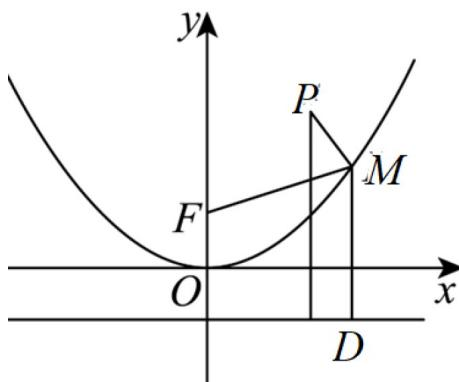

> [!faq]- 《专题12_抛物线标准方程及其性质高频题型精准突破_八大题型__高效培优》官方解析
>
> > [!success]- **【答案】** 12
>
> > [!note]- **【分析】**
> > 原条件转换为 $\left|MP\right| + \left|MD\right|$ 取得最小值 $^{10}$ ，由此即可列方程求解.
>
> > [!note]- **【解析】**
> > 设点 $M$ 在 $C$ 的准线上的射影为 $D$ ，则 $\left|MF\right| = \left|MD\right|$ ，要使 $\left|MP\right| + \left|MF\right|$ 取最小值，即 $\left|MP\right| + \left|MD\right|$ 取得最小值，
> >
> > 当 $D, M, P$ 三点共线时， $\left|MP\right| + \left|MD\right|$ 取得最小值，由 $4 - \left(-\frac{p}{2}\right) = 10$ ，得 $p = 12\cdot$
> >
> > 
> >
> > 故答案为：12.
