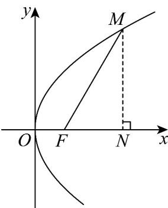
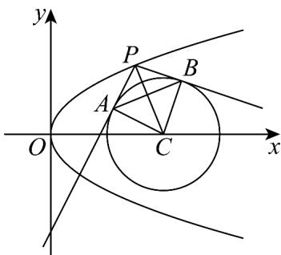

> [!faq]- 《专题12_抛物线标准方程及其性质高频题型精准突破_八大题型__高效培优》官方解析
>
> > [!success]- **【答案】** A
>
> > [!note]- **【分析】**
> > 不妨设点 $M$ 在第一象限，过点 $M$ 作 $MN \perp x$ 轴，求出点 $M$ 的坐标，代入抛物线方程，结合 $p > 0$ 可求得 $p$ 的值.
>
> > [!note]- **【解析】**
> > 不妨设点 $M$ 在第一象限，过点 $M$ 作 $MN \perp x$ 轴，如下图所示：
> >
> > 
> >
> > 因为 $\angle xFM = \frac{\pi}{3}$ ， $|MF| = 4$ ，则 $\left|FN\right| = \left|MF\right|\cos \frac{\pi}{3} = 4\times \frac{1}{2} = 2$
> >
> > $$
> > \left| M N \right| = \left| M F \right| \sin {\frac {\pi}{3}} = 4 \times \frac {\sqrt {3}}{2} = 2 \sqrt {3}
> > $$
> >
> > 易知点 $F\left(\frac{p}{2},0\right)$ ，结合图形可知 $M\left(\frac{p}{2} +2,2\sqrt{3}\right)$
> >
> > 将点 $M$ 的坐标代入抛物线方程得 $2p\left(\frac{p}{2} + 2\right) = (2\sqrt{3})^2 = 12$ ，整理得 $p^2 + 4p - 12 = 0$ ，
> >
> > 因为 p > 0 ，解得 p = 2 .
> >
> > 故选：A.
> >
> > 27. 过抛物线 $y^{2} = 4x$ 上一动点 $P$ 作圆 $C: (x - 4)^{2} + y^{2} = r^{2} (r > 0)$ 的两条切线，切点分别为 $A, B$ ，若 $|AB| \cdot |PC|$ 的最小值是12，则 $r =$ \_\_\_\_.
> >
> > 【答案】 $\sqrt{6}$
> >
> > 【分析】设 $P(x_0, y_0)$ ，利用圆的切线性质，借助图形的面积把 $|AB| \cdot |PC|$ 表示为 $x_0$ 的函数，再求出函数的最小值即可·
> >
> > 【详解】设 $P(x_0, y_0)$ ，则 $y_0^2 = 4x_0$ ，圆 $C$ 的圆心 $C(4, 0)$ ，半径为 $r$ ，
> >
> > 由 $PA, PB$ 切圆 $C$ 于点 $A, B$ ，得 $PC \perp AB, PA \perp AC, PB \perp BC$
> >
> > 
> >
> > $$
> > \left| A B \right| \cdot \left| P C \right| = 2 S _ {\text {四边形} P A C B} = 4 S _ {\mathrm{VPAC}} = 2 \left| P A \right| \cdot \left| A C \right| = 2 r \sqrt {\left| P C \right| ^ {2} - r ^ {2}} = 2 r \sqrt {\left(x _ {0} - 4\right) ^ {2} + y _ {0} ^ {2} - r ^ {2}}
> > $$
> >
> > $$
> > = 2 r \sqrt {x _ {0} ^ {2} - 4 x _ {0} + 1 6 - r ^ {2}} = 2 r \sqrt {(x _ {0} - 2) ^ {2} + 1 2 - r ^ {2}} \quad 2 r \sqrt {1 2 - r ^ {2}}
> > $$
> >
> > 当且仅当 $x_0 = 2$ 时，等号成立，
> >
> > 可知 $\left|AB\right|\cdot\left|PC\right|$ 的最小值为 $2r\sqrt{12-r^{2}}=12$ ，
> >
> > 整理可得 $r^4 - 12r^2 + 36 = 0$ ，解得 $r^2 = 6$
> >
> > 且 $r > 0$ ，所以 $r = \sqrt{6}$
> >
> > 故答案为： $\sqrt{6}$
