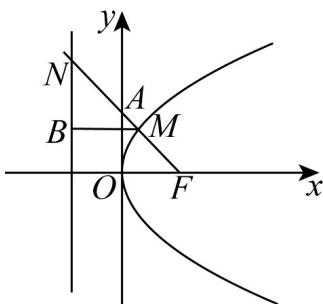

> [!faq]- 《专题12_抛物线标准方程及其性质高频题型精准突破_八大题型__高效培优》官方解析
>
> > [!success]- **【答案】** C
>
> > [!note]- **【分析】**
> > 过 $M$ 作 $BM \perp$ 准线，垂足为 $B$ ，根据抛物线的定义可得 $\cos \angle NMB = \frac{\sqrt{5}}{5}$ ，可得 $\tan \angle AFO = \tan \angle NMB = 2$ ，运算求解即可·
>
> > [!note]- **【解析】**
> > 过 $M$ 作 $BM \perp$ 准线，垂足为 $B$ ，则 $\left|MF\right| = \left|MB\right|$
> >
> > 
> >
> > 由题意可得： $\cos \angle NMB = \frac{|MB|}{|MN|} = \frac{|MF|}{|MN|} = \frac{1}{\sqrt{5}} = \frac{\sqrt{5}}{5}$
> >
> > 且 $\angle NMB$ 为锐角，则 $\sin \angle NMB = \sqrt{1 - \cos^2\angle NMB} = \frac{2\sqrt{5}}{5}$
> >
> > 可得 $\tan \angle NMB = \frac{\sin\angle NMB}{\cos\angle NMB} = 2$
> >
> > 在 $Rt\triangle AOF$ 中， $\tan \angle AFO = \tan \angle NMB = \frac{|AO|}{|OF|}$
> >
> > 即 $\frac{2}{\frac{p}{2}} = 2$ ，解得 $p = 2$
> >
> > 故选 **C**.
