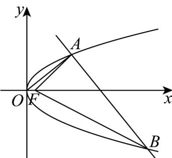

> [!faq]- 《专题12_抛物线标准方程及其性质高频题型精准突破_八大题型__高效培优》官方解析
>
> > [!success]- **【答案】** $2\sqrt{2}+\frac{5}{2}$
>
> > [!note]- **【分析】**
> > 设 $OA$ 方程为 $y = kx$ ，与抛物线方程联立求出点 $A$ 的坐标，进而求得直线 $AB$ 方程，求得点 $B$ 的坐标，由抛物线定义表示出 $\left|FA\right| + \left|FB\right|$ ，利用基本不等式求解.
>
> > [!note]- **【解析】**
> > 设 OA 方程：y = kx，则 $\left\{\begin{aligned} y &= kx \\ y^{2} &= x \end{aligned}\right.$ ，求得 $A\left(\frac{1}{k^{2}}, \frac{1}{k}\right)$ ，
> >
> > 则 $AB$ 方程： $y - \frac{1}{k} = -\frac{1}{k}\left(x - \frac{1}{k^2}\right)$
> >
> > 所以 $\left(-\frac{1}{k} x + \frac{1}{k} + \frac{1}{k^3}\right)^2 = x$ ，即 $\left(k^2 x - k^2 - 1\right)^2 = k^6 x$ ，
> >
> > 所以 $k^4 x^2 -\left(k^6 +2k^4 +2k^2\right)x + \left(k^2 +1\right)^2 = 0$ ，解得 $x_{B} = \left(k + \frac{1}{k}\right)^{2},y_{B} = -\left(k + \frac{1}{k}\right)$
> >
> > 所以 $\left|FA\right|+\left|FB\right|=\frac{1}{k^{2}}+\left(k+\frac{1}{k}\right)^{2}+\frac{1}{2}=k^{2}+\frac{2}{k^{2}}+\frac{5}{2}\quad2\sqrt{k^{2}\cdot\frac{2}{k^{2}}}+\frac{5}{2}=2\sqrt{2}+\frac{5}{2},$
> >
> > 当且仅当 $k^2 = \frac{2}{k^2}$ ，即 $k = \pm 2^{\frac{1}{4}}$ 时，等号成立，
> >
> > 所以 $\left|FA\right|+\left|FB\right|$ 的最小值为 $2\sqrt{2}+\frac{5}{2}$ .
> >
> > 故答案为： $2\sqrt{2}+\frac{5}{2}$
> >
> > 
