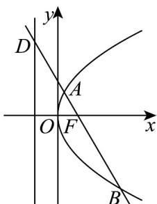

> [!faq]- 《专题12_抛物线标准方程及其性质高频题型精准突破_八大题型__高效培优》官方解析
>
> > [!success]- **【答案】** ABD
>
> > [!note]- **【分析】**
> > 根据直线过焦点可得选项 $^{A}$ 正确；求出点D坐标，利用两点间距离公式可得选项 $^{B}$ 正确；联立直线与抛物线方程，根据弦长公式可得选项 $^{C}$ 错误；求出点A坐标，结合焦半径公式可得选项 $^{D}$ 正确。
>
> > [!note]- **【解析】**
> > 
> >
> > A. 由题意得， $F(1,0)$ ，故 $\frac{p}{2}=1$ ，p=2，A 正确.
> >
> > B. 由 A 得，抛物线标准方程为 $y^{2}=4x$ ，准线方程为 x=-1
> >
> > $\therefore D(-1,2\sqrt{3})$ ，故 $\left|DF\right| = \sqrt{\left(1 + 1\right)^2 + \left(0 - 2\sqrt{3}\right)^2} = 4$ ，B正确·
> >
> > C 设 $A(x_{1},y_{1}), B(x_{2},y_{2})$ ，由 $\left\{\begin{aligned} y &= -\sqrt{3}(x-1) \\ y^{2} &= 4x \end{aligned}\right.$ 得， $3x^{2}-10x+3=0$ ，
> >
> > $\therefore x_{1}+x_{2}=\frac{10}{3}$ ，故 $\left|AB\right|=x_{1}+x_{2}+p=\frac{10}{3}+2=\frac{16}{3}$ ，C错误.
> >
> > D. 由 $3x^{2} - 10x + 3 = 0$ 得， $x_{1} = \frac{1}{3}, x_{2} = 3$ ，故 $x_{A} = \frac{1}{3}$ ，
> >
> > $\therefore \left|AF\right| = \frac{1}{3} +\frac{p}{2} = \frac{1}{3} +1 = \frac{4}{3}$ ，故 $\left|AD\right| = 4 - \frac{4}{3} = \frac{8}{3}$
> >
> > $\therefore |AD|=2|AF|$ ，D正确.
> >
> > 故选 **ABD**.
