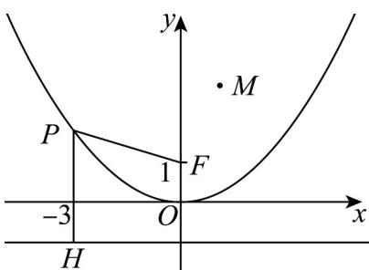

> [!faq]- 《专题12_抛物线标准方程及其性质高频题型精准突破_八大题型__高效培优》官方解析
>
> > [!success]- **【答案】** CD
>
> > [!note]- **【分析】**
> > 根据抛物线的定义得到 $\left|PF\right|=\left|PH\right|$ ，然后根据抛物线的图象即可得到当P在原点时， $\left|PF\right|$ 最小，即可判断A选项；根据抛物线的图象即可判断BD选项；根据抛物线的定义和几何知识可以得到当M,P,H三点共线时 $\left|PM\right|+\left|PF\right|$ 最小，然后求最小值即可判断C选项.
>
> > [!note]- **【解析】**
> > 
> >
> > 作出抛物线 C 的准线 l: y = -1 ，过 P 作 l 的垂线，垂足为 H ，则 $\left|PF\right| = \left|PH\right|$ .
> >
> > 当 P 在原点时， $\left|PF\right|$ 最小为 1，A 错误；
> >
> > 易知抛物线 C 关于 y 轴对称，B 错误；
> >
> > $\because |PM| + |PF| = |PM| + |PH|$ ， $\therefore$ 当 $M, P, H$ 三点共线时 $|PM| + |PF|$ 最小，最小值为 $M$ 到准线 $l: y = -1$ 的距离为 $4$ ， $C$ 正确.
> >
> > 点 $M$ 在抛物线内，故只有当过 $M$ 的直线平行于对称轴 $y$ 轴时，过 $M$ 的直线与抛物线 $C$ 有一个公共点，D正确·
> >
> > 故选 **CD**.
