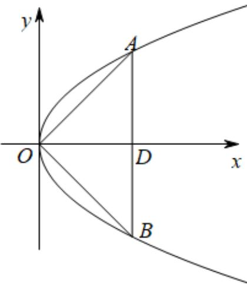

> [!faq]- 《专题12_抛物线标准方程及其性质高频题型精准突破_八大题型__高效培优》官方解析
>
> > [!success]- **【答案】** D
>
> > [!note]- **【分析】**
> > 由题知VAOB为等腰直角三角形，进而得 $A(2,2)$ ，再代入方程求解即可·
>
> > [!note]- **【解析】**
> > 解：∵ $OA \cdot OB = 0$ ，∴ $\left|OA\right| \cdot \left|OB\right| \cdot \cos \angle AOB = 0$ ，∴ $\angle AOB = 90^{\circ}$
> >
> > $\because \left|\mathrm{AB}\right| = 4$ ，且 $AB\perp x$ 轴，
> >
> > ∴由抛物线的对称性VAOB为等腰直角三角形，
> >
> > 设 AB 与 x 轴的交点为 D，
> >
> > $\therefore AD = BD = OD = 2$ ，即 $A(2,2)$
> >
> > $\therefore$ 将 $A(2,2)$ 代入 $y^{2} = 2px$ 得 $4 = 4p$ ，解得 $p = 1$
> >
> > 故选：D.
> >
> > 
