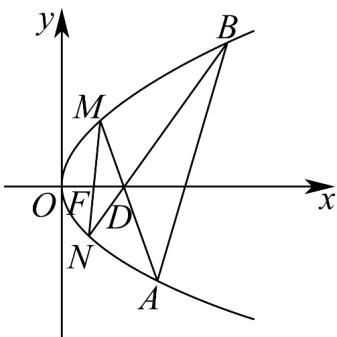

<!-- question-source:start -->
37. 设抛物线 $C: y^2 = 2px(p > 0)$ 的焦点为 $F$ ，点 $D(p, 0)$ ，过 $F$ 的直线交 $C$ 于 $M, N$ 两点。当直线 $MD$ 垂直于 $x$ 轴时， $|MF| = 3$ 。

(1)求 $C$ 的方程；

(2)设直线 $MD, ND$ 与 $C$ 的另一个交点分别为 $A, B$ ，记直线 $MN, AB$ 的斜率为 $k_{1}, k_{2}$ ，求 $\frac{k_{1}}{k_{2}}$ 的值；

(3)记直线 $MN, AB$ 的倾斜角分别为 $\alpha, \beta$ 。当 $\alpha - \beta$ 取得最大值时，求直线 $AB$ 的方程。
<!-- question-source:end -->

![[高中/课堂同步/题库/人教A版高中数学同步讲义(2026)/04_选择性必修第二册/期末/专项训练/专题12_抛物线标准方程及其性质高频题型精准突破_八大题型__高效培优/考点07_直线与抛物线联立问题_sec_10/questions/answers/Q00060953A1.md]]
