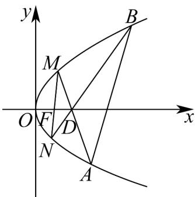

> [!faq]- 《专题12_抛物线标准方程及其性质高频题型精准突破_八大题型__高效培优》官方解析
>
> > [!success]- **【答案】** (1) $y^{2}=4x$ (2) 2 (3) $x-\sqrt{2}y-4=0$
>
> > [!note]- **【分析】**
> > （1）当直线 $MD$ 垂直于 $x$ 轴时，求得 $M(p, \sqrt{2} p)$ ，根据 $\left|MF\right| = 3$ ，结合抛物线的定义，求得 $p = 2$ ，即可求解；
> >
> > (2) 设 $M(x_{1}, y_{1}), N(x_{2}, y_{2}), A(x_{3}, y_{3}), B(x_{4}, y_{4})$ ，设直线 $AM: y = k_{3}(x - 2)$ ，直线 $BN: y = k_{4}(x - 2)$ ，联立方程组，求得 $y_{1} + y_{3} = \frac{4}{k_{3}}, y_{1}y_{3} = -8$ 和 $y_{2} + y_{4} = \frac{4}{k_{4}}, y_{2}y_{4} = -8$ ，化简得到 $\frac{k_1}{k_2} = -\frac{8}{y_1y_2}$ ，再由抛物线的几何性质，得到 $y_{1}y_{2} = -4$ ，即可求解；
> >
> > (3) 当直线 $MN$ 的斜率不存在时，求得 $\alpha - \beta = 0$ ；当 $MN$ 的斜率存在时，得到 $\tan \alpha = k$ ，且 $\tan \beta = \frac{k}{2}$ ，求得 $\tan (\alpha - \beta) = \frac{k}{2 + k^2}$ ，结合基本不等式，求得当 $k = \sqrt{2}$ 时，取得最大值，进而求得直线 $AB$ 的方程。
>
> > [!note]- **【解析】**
> > （1）解：当直线 $MD$ 垂直于 $x$ 轴时，由点点 $D(p,0)$ ，可得 $M(p,\sqrt{2} p)$
> >
> > 因为 $\left|MF\right|=3$ ，由抛物线的定义，可得 $p+\frac{p}{2}=3$ ，解得p=2，
> >
> > 所以抛物线 C 的方程为 $y^{2}=4x$ .
> >
> > (2) 解：设 $M(x_{1}, y_{1}), N(x_{2}, y_{2}), A(x_{3}, y_{3}), B(x_{4}, y_{4})$
> >
> > 设直线 AM 的方程为 $y = k_{3}(x - 2)$ ，直线 BN 的方程为 $y = k_{4}(x - 2)$ ，
> >
> > 联立方程组 $\left\{ \begin{array}{l} y = k_{3}(x - 2) \\ y^{2} = 4x \end{array} \right.$ ，整理得 $y^{2} - \frac{4}{k_{3}} y - 8 = 0$ ，可得 $y_{1} + y_{3} = \frac{4}{k_{3}}, y_{1}y_{3} = -8$ ，
> >
> > 联立方程组 $\left\{ \begin{array}{l} y = k_{4}(x - 2) \\ y^{2} = 4x \end{array} \right.$ ，整理得 $y^{2} - \frac{4}{k_{4}} y - 8 = 0$ ，可得 $y_{2} + y_{4} = \frac{4}{k_{4}}, y_{2}y_{4} = -8$
> >
> > 又由直线 $MN$ 的斜率为 $k_{1} = \frac{y_{2} - y_{1}}{x_{2} - x_{1}} = \frac{y_{2} - y_{1}}{\frac{y_{2}^{2}}{4} - \frac{y_{1}^{2}}{4}} = \frac{4}{y_{2} + y_{1}}$
> >
> > 且直线 AB 的斜率为 $k_{2}=\frac{y_{4}-y_{3}}{x_{4}-x_{3}}=\frac{y_{4}-y_{3}}{\frac{y_{4}^{2}}{4}-\frac{y_{3}^{2}}{4}}=\frac{4}{y_{3}+y_{4}}=\frac{4}{-\left(\frac{8}{y_{1}}+\frac{8}{y_{2}}\right)}=-\frac{y_{1}y_{2}}{2(y_{1}+y_{2})}$
> >
> > 所以 $\frac{k_1}{k_2} = \frac{\frac{4}{y_2 + y_1}}{-\frac{y_1y_2}{2(y_1 + y_2)}} = -\frac{8}{y_1y_2}$
> >
> > 当直线 $MN$ 的斜率不存在时，直线 $MN$ 的方程为 $x = 1$ ，解得 $y_{1}y_{2} = -4$ ，则 $\frac{k_1}{k_2} = 2$
> >
> > 当直线 $MN$ 的斜率存在时，直线 $MN$ 的方程为 $y = k(x - 1)$
> >
> > 联立方程组 $\left\{ \begin{array}{l} y = k(x - 1) \\ y^2 = 4x \end{array} \right.$ ，整理得 $y^2 - \frac{4}{k} y - 4 = 0$ ，可得 $y_1 + y_2 = \frac{4}{k}, y_1y_2 = -4$ ，则 $\frac{k_1}{k_2} = 2$ ，
> >
> > 综上可得， $\frac{k_{1}}{k_{2}}$ 的值为 $_{2}$
> >
> > (3) 解：设 $M(x_{1},y_{1}), N(x_{2},y_{2}), A(x_{3},y_{3}), B(x_{4},y_{4})$
> >
> > 当直线 MN 的斜率不存在时，由对称性可知，直线 AB 的斜率也不存在，
> >
> > 此时 $\alpha = \beta = \frac{\pi}{2}$ ，则 $\alpha -\beta = 0$
> >
> > 当直线 MN 的斜率存在时，由 $(2)$ 知： $y_{1} + y_{2} = \frac{4}{k}, y_{1}y_{2} = -4$
> >
> > 则 $\tan \alpha = k_{1} = \frac{4}{y_{2} + y_{1}} = k$ ，且 $\tan \beta = k_{2} = -\frac{y_{1}y_{2}}{2(y_{1} + y_{2})} = \frac{k}{2}$
> >
> > 所以 $\tan \alpha$ 与 $\tan \beta$ 的正负相同，所以 $-\frac{\pi}{2} < \alpha - \beta < \frac{\pi}{2}$ ，
> >
> > 所以当 $\alpha -\beta$ 最大时， $\tan (\alpha -\beta)$ 取得最大值，
> >
> > 又由 $\tan (\alpha -\beta) = \frac{\tan\alpha - \tan\beta}{1 + \tan\alpha\tan\beta} = \frac{k - \frac{k}{2}}{1 + \frac{k^2}{2}} = \frac{k}{2 + k^2} = \frac{1}{k + \frac{2}{k}}$
> >
> > 要使得 $\tan(\alpha-\beta)$ 取得最大值，显然 k>0
> >
> > 由 $k > 0$ 时， $k + \frac{2}{k} - 2\sqrt{k \cdot \frac{2}{k}} = 2\sqrt{2}$ ，当且仅当 $k = \sqrt{2}$ 时，等号成立，
> >
> > 所以 $\tan (\alpha -\beta)\leq \frac{\sqrt{2}}{4}$ ，此时 $\tan (\alpha -\beta)$ 取得最大值 $\frac{\sqrt{2}}{4}$
> >
> > 又由 $AB$ 的方程为 $y - y_{3} = \frac{4}{y_{3} + y_{4}} (x - x_{3})$ ，即 $4x - (y_{3} + y_{4})y + y_{3}y_{4} = 0$
> >
> > 由（2）知： $y_{1}y_{3} = -8$ ， $y_{2}y_{4} = -8$ ，且 $y_{1} + y_{2} = \frac{4}{k}, y_{1}y_{2} = -4$
> >
> > 可得 $y_{3} = -\frac{8}{y_{1}}, y_{4} = -\frac{8}{y_{2}}$ ，则 $y_{3} + y_{4} = -\frac{8(y_{1} + y_{2})}{y_{1}y_{2}} = \frac{8}{k} = 4\sqrt{2}$ ， $y_{3}y_{4} = \frac{8}{y_{1}} \cdot \frac{8}{y_{2}} = -16$
> >
> > 所以直线 $AB$ 的方程为 $4x - 4\sqrt{2} y - 16 = 0$ ，即 $x - \sqrt{2} y - 4 = 0$ 。
> >
> > 
