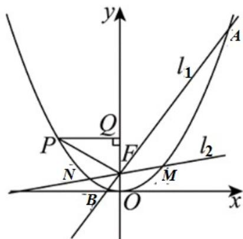

> [!faq]- 《专题12_抛物线标准方程及其性质高频题型精准突破_八大题型__高效培优》官方解析
>
> > [!success]- **【答案】** (1) $p = 4$ (2) $\left|PF\right|=8$ (3) $3x-y+2=0$ （或 $y=3x+2$ ）
>
> > [!note]- **【分析】**
> > （1）根据抛物线的性质可求得 $p$ 的值；
> >
> > (2) 过点 $P$ 作 $PQ \perp OF$ ，垂足为 $Q$ ，设 $\left|QF\right| = a$ 可推得 $\left|PF\right| = 2a$ ，利用抛物线的定义求出 $a = 4$ 即可；
> >
> > （3）设 $l_{1}$ 的倾斜角为 $\alpha$ ，斜率 $k = \tan \alpha$ ，则 $l_{2}$ 的倾斜角为 $\beta = \alpha +\frac{\pi}{4}$ ，利用和角的正切公式推得其斜率
> >
> > $k_{2}=\frac{k+1}{1-k}$ ，联立 $l_{1}$ 与抛物线方程，分别求出弦长 $|AB|$ 与 $|MN|$ ，利用题设条件求得k=-1或k=3，检验后即可求得 $l_{1}$ 的方程.
>
> > [!note]- **【解析】**
> > （1）由抛物线的性质可得 $\frac{1}{2} p = 2$ ，得 $p = 4$ ；
> >
> > (2) 抛物线 C 的准线方程为 y = -2.
> >
> > 过点 P 作 $PQ \perp OF$ ，垂足为 Q，
> >
> > 设 $\left|QF\right|=a$ ，因 $\angle PFO=\frac{2\pi}{3}$ ，则 $\angle PFQ=\frac{\pi}{3}$ ，得 $\left|PF\right|=2a$ ，
> >
> > 则点 $P$ 的纵坐标为 $a + 2$ ，由抛物线定义得 $\left|PF\right| = 2a = a + 2 + 2$
> >
> > 解得 a = 4 ，所以 $\left|PF\right| = 8$ ；
> >
> > （3）设 $l_{1}$ 的倾斜角为 $\alpha$ ，易得 $\alpha \neq \frac{\pi}{2}$ ，斜率 $k = \tan \alpha$ ，
> >
> > 
> >
> > 则 $l_{2}$ 的倾斜角为 $\beta=\alpha+\frac{\pi}{4}$ ，
> >
> > 斜率 $k_{2} = \tan \beta = \tan \left(\alpha +\frac{\pi}{4}\right) = \frac{\tan\alpha + 1}{1 - \tan\alpha} = \frac{k + 1}{1 - k}.$
> >
> > 设点 $A(x_{1},y_{1})$ ， $B(x_{2},y_{2})$ ， $l_{1}:y=kx+2$
> >
> > 由 $\left\{ \begin{array}{l} y = kx + 2 \\ x^2 = 8y \end{array} \right.$ 得 $x^2 - 8kx - 16 = 0$ ，得 $\left\{ \begin{array}{l} x_1 + x_2 = 8k \\ x_1x_2 = -16 \end{array} \right.$
> >
> > 所以 $\left|AB\right|=y_{1}+y_{2}+p=k\left(x_{1}+x_{2}\right)+8=8\left(k^{2}+1\right)$ .
> >
> > 以 $\frac{k+1}{1-k}$ 代 k 可得 $|MN|=8\left(k_{2}^{2}+1\right)=8\left[\left(\frac{k+1}{1-k}\right)^{2}+1\right]=\frac{16\left(k^{2}+1\right)}{\left(1-k\right)^{2}}$ .
> >
> > 由 $\left|AB\right|=2\left|MN\right|$ ，得 $8(k^{2}+1)=2\times\frac{16(k^{2}+1)}{(1-k)^{2}}$ ，
> >
> > 得 k = -1 或 k = 3 ，
> >
> > 当 $k = -1$ 时， $\alpha = \frac{3\pi}{4}$ ， $\beta = \pi$ ，又 $\beta \in [0,\pi)$ ，所以 $k = -1$ 不符合题意
> >
> > 故 $l_{1}$ 的方程为 $y=3x+2$ ，即 $3x-y+2=0$ （或 $y=3x+2$ ）.
