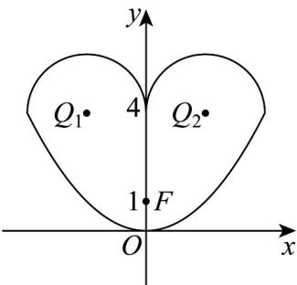

> [!faq]- 《专题12_抛物线标准方程及其性质高频题型精准突破_八大题型__高效培优》官方解析
>
> > [!success]- **【答案】** ABD
>
> > [!note]- **【分析】**
> > 利用点到直线距离判断 $^{A}$ ；利用抛物线定义将抛物线上点到焦点的距离转化为到准线的距离即可求最值判断 $^{B}$ ；根据图形的对称性以及直线过定点设设直线 $MN: y = kx + 1 \quad (k = 0)$ ，利用圆心到直线距离确定 到直线 $MN$ 的距离 $d \leq \frac{|-2k - 3|}{\sqrt{k^2 + 1}} + 2$ ，直曲联立得 $MN = 4(k^2 + 1)$ ，构造函数利用导数判断函数的单调性求得最值判断 C；利用点差法求出直线 $MN$ 方程，直曲联立利用弦长公式求出 $|MN|$ ，再利用极化恒等式即可判断 D.
>
> > [!note]- **【解析】**
> > 
> >
> > 根据题意，因为半圆 $O_{1}:(x-2)^{2}+(y-4)^{2}=4$ （y 4）
> >
> > 表示以 $O_{1}(2,4)$ 为圆心，2为半径的圆的上半部分，
> >
> > 又因为半圆 $O_{2}$ 与半圆 $O_{1}$ 关于 $y$ 轴对称，
> >
> > 可得半圆 $O_{2}:(x+2)^{2}+(y-4)^{2}=4$ （y 4），
> >
> > 表示以 $O_{2}(-2,4)$ 为圆心，2 为半径的圆的上半部分.
> >
> > 对于选项 A，直线 $O_{2}F$ 的方程为 $3x + 2y - 2 = 0$
> >
> > $O_{1}$ 到直线 $O_{2}F$ 的距离为 $\frac{12\sqrt{13}}{13}$
> >
> > 所以 $P$ 到直线 $O_{2}F$ 的距离最大值为 $\frac{12\sqrt{13}}{13} + 2$ ，故选项A正确；
> >
> > 对于选项 B，抛物线 $C: x^{2} = 4y$ 的准线为 l: y = -1
> >
> > 过点 $N$ 作 $NN_{1} \perp l$ ，垂足为 $N_{1}$
> >
> > 则 $\left|NF\right|=\left|NN_{1}\right|$ ，则 $\left|PN\right|+\left|NF\right|=\left|PN\right|+\left|NN_{1}\right|$ $4+1=5$
> >
> > 故选项 $^{B}$ 正确；
> >
> > 对于选项 C，根据对称性，不妨设直线 $MN: y = kx + 1 \quad (k \quad 0)$ ，
> >
> > 显然离 MN 距离最远的点在 $O_{2}$ 上，
> >
> > 设 $P$ 到直线 $MN$ 的距离为 $d$ ，则 $d \leq \frac{|-2k - 3|}{\sqrt{k^2 + 1}} + 2$
> >
> > 联立 $\left\{ \begin{array}{l} y = kx + 1, \\ x^2 = 4y, \end{array} \right.$ 消去 $y$ ，整理得 $x^2 - 4kx - 4 = 0$ ， $0 \leq k \leq \frac{4 - 1}{4 - 0} = \frac{3}{4}$ ，
> >
> > 则 $x_{M} + x_{N} = 4k$ ， $x_{M}x_{N} = -4$
> >
> > 所以 $\left|MN\right|=\sqrt{1+k^{2}}\sqrt{\left(x_{M}+x_{N}\right)^{2}-4x_{M}x_{N}}=4\left(k^{2}+1\right)$
> >
> > 所以 $S_{\triangle PMN} = \frac{1}{2} |MN| d \leq \frac{1}{2} \times 4(k^{2} + 1) \left( \frac{|-2k - 3|}{\sqrt{k^{2} + 1}} + 2 \right)$
> >
> > $$
> > = 2 \sqrt {k ^ {2} + 1} (2 k + 3) + 4 (k ^ {2} + 1)
> > $$
> >
> > 设 $h(k) = 2\sqrt{k^2 + 1}(2k + 3) + 4(k^2 + 1)$ ，易得 $h(k)$ 在 $\left[0, \frac{3}{4}\right]$ 上单调递增，
> >
> > 所以 $S_{\triangle PMN}$ 的最大值为 $h\left(\frac{3}{4}\right) = \frac{35}{2}$ ，故选项C错误；
> >
> > 对于选项D，因为 $x_{M}^{2} = 4y_{M}$ ， $x_{N}^{2} = 4y_{N}$
> >
> > 所以 $\left(x_{M} - x_{N}\right)\left(x_{M} + x_{N}\right) = 4\left(y_{M} - y_{N}\right)$
> >
> > 所以 $k_{MN}=\frac{y_{M}-y_{N}}{x_{M}-x_{N}}=\frac{x_{M}+x_{N}}{4}=\frac{1}{2}$
> >
> > 所以直线 $MN$ 的方程为 $x - 2y + 1 = 0$
> >
> > 联立 $\left\{ \begin{array}{l}x - 2y + 1 = 0,\\ x^2 = 4y, \end{array} \right.$ 消去 $y$ ，整理得 $x^{2} - 2x - 2 = 0$
> >
> > 则 $x_{M} + x_{N} = 2$ ， $x_{M}x_{N} = -2$
> >
> > 所以 $\left|MN\right|=\sqrt{1+\left(\frac{1}{2}\right)^{2}}\sqrt{\left(x_{M}+x_{N}\right)^{2}-4x_{M}x_{N}}=\sqrt{15}$
> >
> > $\square\square\square\square\cdot\square\square\square=P M\cdot PN=\left(PQ+QM\right)\cdot\left(PQ+QN\right)=\left|PQ\right|^{2}-\frac{1}{4}\left|M N\right|^{2}$
> >
> > $= \left|\overline{P} \overline{Q}\right|^2 - \frac{15}{4} \leq \left(\left|\overline{O_1Q}\right| + 2\right)^2 - \frac{15}{4} = 4\sqrt{10} + \frac{41}{4}$ ，故选项D正确.
> >
> > 故选 **ABD**.
