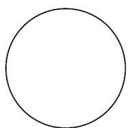
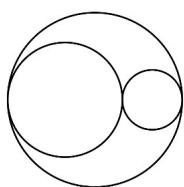
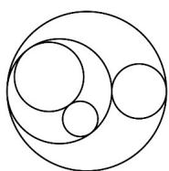

<!-- question-source:start -->
56. 如图，在一个大圆中放入两个半径之比为 $1:2$ 的小圆，使得两小圆外切，且它们均内切于大圆，且三个切点共线，记为一次操作·之后的每次操作，都在前一次放入的较大的圆中进行上述操作，现有一个半径为 $1$ 的大圆，则 $4$ 次操作后图中最小的圆的半径为 $\_\_\_\_\_\_\_\_\_\_\_\_\_\_\_\_\_\_\_\_\_\_\_\_\_\_\_\_\_\_\_\_\_\_\_\_\_\_\_\_\_\_\_\_.$

第1次操作前

第2次操作后

第3次操作后
<!-- question-source:end -->

![[高中/课堂同步/题库/人教A版高中数学同步讲义(2026)/04_选择性必修第二册/期末/专项训练/专题14_等比数列高频题型精准突破_十大题型__高效培优期末专项训练_/_compact/answers/Q00061067A1.md]]
