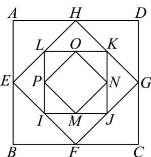

<!-- question-source:start -->
60. 如图，正方形 $ABCD$ 的边长为 $4$ ，取正方形 $ABCD$ 各边的中点 $E, F, G, H$ ，作第 $2$ 个正方形 $EFGH$ ，然后再取正方形 $EFGH$ 各边的中点 $I, J, K, L$ ，作第 $3$ 个正方形 $IJKL$ ·如果这个作图过程可以一直继续下去，那么这些正方形的面积之和将趋近于（）

A. 32 B. 40 C. 48 D. 64
<!-- question-source:end -->

![[高中/课堂同步/题库/人教A版高中数学同步讲义(2026)/04_选择性必修第二册/期末/专项训练/专题14_等比数列高频题型精准突破_十大题型__高效培优期末专项训练_/_compact/answers/Q00061070A1.md]]
