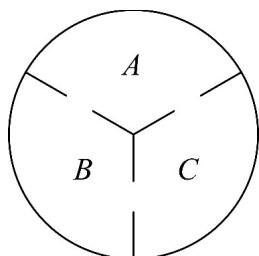

## 考点04 构造法求通项

19．1827年英国植物学家布朗用显微镜观察悬浮在水中的花粉时发现被分子撞击的悬浮微粒做无规则运动，这类运动被称为布朗运动．在如图所示的容器截面图中，A，B，C表示容积相等的三部分区域，每块区域都有大小相同的小孔进行联通．假设某粒子做布朗运动时，会等可能的随机选择一个小孔到达另一区域，已知该粒子的初始位置在A区域，且粒子经过n次随机选择后到达A区域的概率为 $A_{n}$ ，则 $A_{5}=$ \_\_\_\_.

【答案】 $\frac{5}{16}$

【分析】记粒子经过 n 次随机选择后到达 B 区域的概率为 $B_{n}$ ，到达 C 区域的概率为 $C_{n}$ ，从而得到方程组，变形得到 $A_{n+1}-\frac{1}{3}=-\frac{1}{2}\left(A_{n}-\frac{1}{3}\right)$ ，故 $A_{n}=\frac{1}{3}-\frac{1}{3}\cdot(-\frac{1}{2})^{n-1}$ ，求出答案·

【详解】记粒子经过 $n$ 次随机选择后到达 $B$ 区域的概率为 $B_{n}$

粒子经过 n 次随机选择后到达 C 区域的概率为 $C_{n}$

则有 $\left\{ \begin{array}{l} A_{n} + B_{n} + C_{n} = 1 \\ A_{n + 1} = \frac{1}{2} C_{n} + \frac{1}{2} B_{n} \end{array} \right.$ ，可得 $A_{n + 1} = \frac{1}{2}(1 - A_n)$

则 $A_{n + 1} - \frac{1}{3} = -\frac{1}{2} A_n + \frac{1}{2} -\frac{1}{3} = -\frac{1}{2} A_n + \frac{1}{6} = -\frac{1}{2}\left(A_n - \frac{1}{3}\right)$

因为 $A_{1} = 0$ ，所以数列 $\left\{A_n - \frac{1}{3}\right\}$ 是首项为 $-\frac{1}{3}$ ，公比为 $-\frac{1}{2}$ 的等比数列，

故 $A_{n} - \frac{1}{3} = -\frac{1}{3}\cdot (-\frac{1}{2})^{n - 1}$ ，即 $A_{n} = \frac{1}{3} -\frac{1}{3}\cdot (-\frac{1}{2})^{n - 1}$

故 $A_{5} = \frac{1}{3} -\frac{1}{3}\cdot (-\frac{1}{2})^{4} = \frac{1}{3} -\frac{1}{3}\times \frac{1}{16} = \frac{5}{16}$

故答案为： $\frac{5}{16}$

20. 数列 $\{a_{n}\}$ 满足 $a_1 = \frac{1}{2}$ ， $a_{n+1} = \frac{a_n}{3a_n + 1}$ ·正项等比数列 $\{b_n\}$ 满足 $b_1 = 2$ ， $b_3 = b_2 + 4$ ·

(1)证明数列 $\left\{\frac{1}{a_n}\right\}$ 为等差数列，并求数列 $\{a_{n}\}$ 的通项公式；

(2)令 $c_{n} = \frac{b_{n}}{a_{n}}$ ，求数列 $\{c_n\}$ 的前 $n$ 项和 $S_{n}$

【答案】(1)证明见解析， $a_{n}=\frac{1}{3n-1}$

(2) $S_{n} = (3n - 4)\times 2^{n + 1} + 8$

【分析】（1）两边取倒数得到 $\frac{1}{a_{n + 1}} -\frac{1}{a_n} = 3$ ，根据等差数列的定义判断数列 $\left\{\frac{1}{a_n}\right\}$ 为等差数列，利用等差数列通项公式求出数列通项即可进一步求解数列 $\{a_{n}\}$ 的通项公式；

(2) 利用等比数列通项公式结合已知条件求出数列 $\{b_n\}$ 的通项公式，进而求出数列 $\{c_n\}$ 的通项公式，利用错位相减法求数列 $\{c_n\}$ 的前 $n$ 项和即可·

【详解】（1）由题意得， $\frac{1}{a_{n+1}}=\frac{3a_{n}+1}{a_{n}}=\frac{1}{a_{n}}+3$ ，即 $\frac{1}{a_{n+1}}-\frac{1}{a_{n}}=3$ ，且 $\frac{1}{a_{1}}=2$ ，

所以 $\left\{\frac{1}{a_n}\right\}$ 是以 $^2$ 为首项， $3$ 为公差的等差数列，

$\frac{1}{a_n} = 2 + 3(n - 1) = 3n - 1$ $\therefore a_{n} = \frac{1}{3n - 1}$ (2) 设 $\left\{b_{n}\right\}$ 的公比为 q，∵ $b_{1}=2$ ， $b_{3}=b_{2}+4$ ，
则 $2q^{2}=2q+4$ ，解得 q=2 或 -1（舍去），
∴ $b_{n}=2^{n}$ ，∴ $c_{n}=\frac{b_{n}}{a_{n}}=2^{n}(3n-1)$ . $S_{n}=2\times2^{1}+5\times2^{2}+8\times2^{3}+\cdots+(3n-1)\times2^{n}$ ，① $2S_{n}=2\times2^{2}+5\times2^{3}+\cdots+(3n-4)\times2^{n}+(3n-1)\times2^{n+1}$ ，②
① - ②，得 $-S_{n}=2\times2^{1}+3\times\left(2^{2}+2^{3}+\cdots+2^{n}\right)-\left(3n-1\right)\times2^{n+1}$ $=4+3\times\frac{4\left(1-2^{n-1}\right)}{1-2}-\left(3n-1\right)\times2^{n+1}=\left(4-3n\right)\times2^{n+1}-8$ 所以 $S_{n}=(3n-4)\times2^{n+1}+8$

![[高中/课堂同步/题库/人教A版高中数学同步讲义(2026)/04_选择性必修第二册/期末/专项训练/专题15_数列各类通项及求和高频题型精准突破_十大题型__高效培优期末/考点04_构造法求通项_sec_07/questions/Q00061088.md]]
![[高中/课堂同步/题库/人教A版高中数学同步讲义(2026)/04_选择性必修第二册/期末/专项训练/专题15_数列各类通项及求和高频题型精准突破_十大题型__高效培优期末/考点04_构造法求通项_sec_07/questions/Q00061089.md]]
![[高中/课堂同步/题库/人教A版高中数学同步讲义(2026)/04_选择性必修第二册/期末/专项训练/专题15_数列各类通项及求和高频题型精准突破_十大题型__高效培优期末/考点04_构造法求通项_sec_07/questions/Q00061090.md]]
![[高中/课堂同步/题库/人教A版高中数学同步讲义(2026)/04_选择性必修第二册/期末/专项训练/专题15_数列各类通项及求和高频题型精准突破_十大题型__高效培优期末/考点04_构造法求通项_sec_07/questions/Q00061091.md]]
