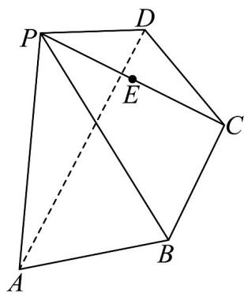

<!-- question-source:start -->
27. 如图，四棱锥 $P - ABCD$ 中，平面 $PAD \perp$ 平面 $ABC$ ， $\triangle PAD$ 为等边三角形，底面 $AB - CD$ 为等腰梯形，且 $AD = 2AB = 2BC = 4$ ，点 $E$ 是棱 $PC$ 的中点，过点 $A$ ， $B$ ， $E$ 的平面 $\alpha$ 交棱 $PD$ 于点 $F$ ：

(1)证明： $AD \parallel$ 平面 PBC；

(2)求 $\frac{PF}{DF}$ 的值.
<!-- question-source:end -->

![[高中/课堂同步/题库/人教A版高中数学同步讲义(2026)/04_选择性必修第二册/期末/专题01 空间向量及其运算高频题型精准突破（八大题型）（高效培优期末专项训练）/专题01_空间向量及其运算_八大题型/questions/answers/Q00080871A1.md]]
