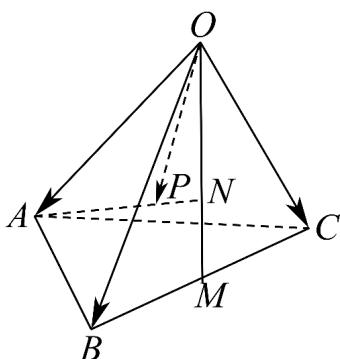

<!-- question-source:start -->
44. 如图，在四面体 $OABC$ 中， $M$ 为棱 $BC$ 的中点，点 $N, P$ 分别满足 $ON = 2NM$ ， $AP = \frac{2}{3}AN$ 则 $OP = (\quad)$

A. $\frac{1}{3}OA+\frac{2}{3}OB+\frac{2}{3}OC$

B. $\frac{1}{3}OA+\frac{2}{9}OB+\frac{2}{9}OC$

C. $\frac{1}{3}OA+\frac{4}{9}OB+\frac{4}{9}OC$

D. $\frac{1}{3} OA + \frac{1}{3} OB + \frac{1}{3} OC$
<!-- question-source:end -->

![[高中/课堂同步/题库/人教A版高中数学同步讲义(2026)/04_选择性必修第二册/期末/专题01 空间向量及其运算高频题型精准突破（八大题型）（高效培优期末专项训练）/专题01_空间向量及其运算_八大题型/questions/answers/Q00080888A1.md]]
