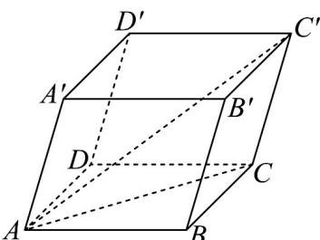

<!-- question-source:start -->
56. 如图所示，在平行六面体 $ABCD - A'B'C'D'$ 中， $AB = AD = 2$ ， $AA' = 3$ ， $\angle BAD = 45^\circ$ ， $\angle BAA' = \angle DAA' = 60^\circ$ 。

(1)求 $BB'\cdot AC'$ ;

(2)求线段 $AC'$ 的长.
<!-- question-source:end -->

![[高中/课堂同步/题库/人教A版高中数学同步讲义(2026)/04_选择性必修第二册/期末/专题01 空间向量及其运算高频题型精准突破（八大题型）（高效培优期末专项训练）/专题01_空间向量及其运算_八大题型/questions/answers/Q00080900A1.md]]
