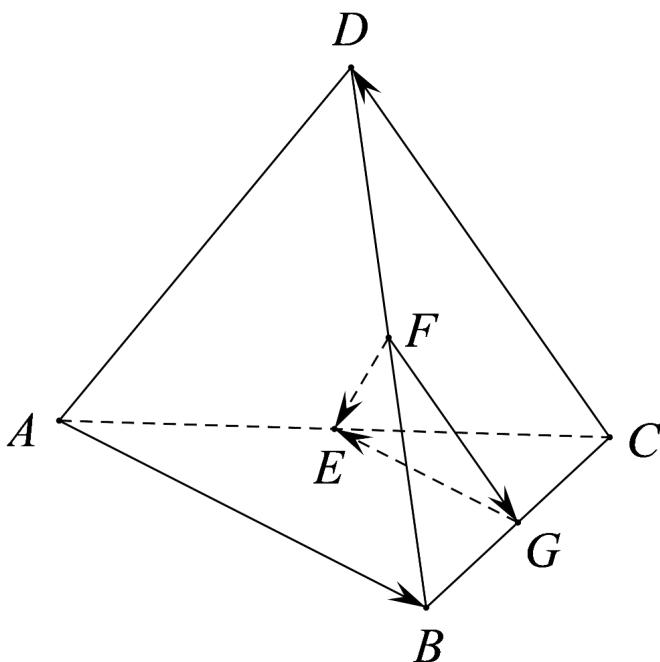

> [!faq]- 《专题01 空间向量及其运算高频题型精准突破（八大题型）（高效培优期末专项训练）》官方解析
>
> > [!success]- **【答案】** $-\frac{1}{2}$
>
> > [!note]- **【分析】**
> > 根据向量线性运算规则，用向量 $\overline{AB},\overline{CD}$ 表示出 $\overline{EF}$ ，求出参数的值.
>
> > [!note]- **【解析】**
> > 
> >
> > 在四面体 $ABCD$ 中，棱 $AC$ ， $BD$ 的中点分别为 $E$ ， $F$ ，取 $BC$ 的中点 $G$ ，所以 $\frac{FG}{2} = \frac{1}{2} \frac{DC}{2} = -\frac{1}{2} \frac{CD}{2}$ $GE = \frac{1}{2} \frac{BA}{2} = -\frac{1}{2} \frac{AB}{2}$ ，
> >
> > 所以 $\overrightarrow{FE} = \overrightarrow{FG} +\overrightarrow{GE} = -\frac{1}{2}\overrightarrow{CD} -\frac{1}{2}\overrightarrow{AB} = -\frac{1}{2}\left(-4a + 8b - 2c\right) - \frac{1}{2}\left(2a + 3c\right) = \overrightarrow{a} -\overrightarrow{b} -\frac{1}{2} c$
> >
> > 又因为 $FE = a - 4b + kc$ ，所以 $k = -\frac{1}{2}$ .
> >
> > 故答案为： $-\frac{1}{2}$
> >
> > ## 考点02 空间向量的共线判定
