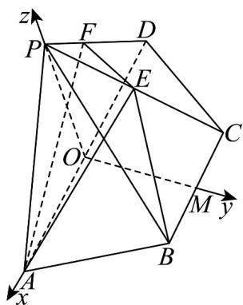

> [!faq]- 《专题01 空间向量及其运算高频题型精准突破（八大题型）（高效培优期末专项训练）》官方解析
>
> > [!success]- **【答案】** $^{(1)}$ 证明见解析 (2) $\frac{1}{4}$
>
> > [!note]- **【分析】**
> > （1）运用等腰梯形性质，结合线面平行判定定理证明即可；（2）建立空间直角坐标系，结合四点共面的向量定理计算即可·
>
> > [!note]- **【解析】**
> > （1）因为底面 AB - CD 为等腰梯形，且 AD = 2AB = 2BC = 4，所以 AD // BC。
> >
> > 又因为 $BC \subset$ 平面 PBC ， $AD \notin$ 平面 PBC ，
> >
> > 所以 $AD / /$ 平面PBC.
> >
> > (2) 因为 $\triangle PAD$ 为等边三角形， $AD = 4$ ，取 $AD$ 中点 $O$ ，连接 $OP$ ，则 $OP \perp AD$ 。又因为平面 $PAD \perp$ 平面 $ABC$ ，平面 $PAD \cap$ 平面 $ABC = AD$ ， $OP \subset$ 平面 $PAD$ ，所以 $OP \perp$ 平面 $ABC$ 。
> >
> > 因为 $BC // AD$ ， $AD = 2BC$ ， $O$ 为 $AD$ 中点， $M$ 为 $BC$ 中点，所以 $OM \perp AD$
> >
> > 以 OA 为 x 轴，OM 为 y 轴，OP 为 z 轴建立空间直角坐标系.
> >
> > 
> >
> > ，且为等边三角形，可求得
> >
> > $$
> > A D = 2 A B = 2 B C = 4 \quad \triangle P A D
> > $$
> >
> > $$
> > O P = 2 \sqrt {3}, O M = \sqrt {C D ^ {2} - (D O - C M) ^ {2}} = \sqrt {3}.
> > $$
> >
> > 则 $A(2,0,0)$ ， $D(-2,0,0)$ ， $P(0,0,6)$ ， $B(1,\sqrt{3},0)$
> >
> > 那么 $PD = (-2, 0, -6)$ . 设 $PF = \lambda PD$ , 所以设 $F(-2\lambda, 0, -6\lambda)$ .
> >
> > 又因为点 $E$ 是棱 $PC$ 的中点，设 $C(-1, \sqrt{3}, 0)$ ，则 $E\left(-\frac{1}{2}, \frac{\sqrt{3}}{2}, 3\right)$ .
> >
> > 因为 A, B, E, F 四点共面，所以 $\overset{\text{UUU}}{AE}$ , $\overset{\text{UUU}}{AB}$ , $\overset{\text{UUU}}{AF}$ 共面.
> >
> > $$
> > \stackrel {\square \square \square} {A E} = \left(- \frac {5}{2}, \frac {\sqrt {3}}{2}, 3\right), \stackrel {\square \square \square} {A B} = (- 1, \sqrt {3}, 0), \stackrel {\square \square \square} {A F} = (- 2 \lambda - 2, 0, - 6 \lambda).
> > $$
> >
> > 设存在实数 $m$ ， $n$ ，使得 $\overline{AE} = m\overline{AB} + n\overline{AF}$ ，则可得方程组：
> >
> > $$
> > \left\{ \begin{array}{l} - \frac {5}{2} = - m + n (- 2 \lambda - 2) \\ \frac {\sqrt {3}}{2} = \sqrt {3} m \\ 3 = n (- 6 \lambda) \end{array} \right.
> > $$
> >
> > 解得
> >
> > $$
> > m = \frac {1}{2} \lambda = - \frac {1}{3} n = \frac {3}{2}
> > $$
> >
> > 所以 $\overline{PF} = -\frac{1}{3}\overline{PD}$ ，则 $\left|\overline{PF}\right| = \frac{1}{3}\left|\overline{PD}\right|$ ， $\left|\overline{DF}\right| = \frac{4}{3}\left|\overline{PD}\right|$ .
> >
> > 所以 $\frac{PF}{DF}=\frac{\left|\begin{matrix}\vec{P}F\\ \vec{P}D\end{matrix}\right|}{\left|DF\right|}=\frac{\frac{1}{3}\left|\begin{matrix}\vec{PD}\\ \vec{PD}\end{matrix}\right|}{\frac{4}{3}\left|\begin{matrix}\vec{PD}\\ \vec{PD}\end{matrix}\right|}=\frac{1}{4}.$
