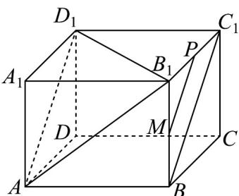

> [!faq]- 《专题01 空间向量及其运算高频题型精准突破（八大题型）（高效培优期末专项训练）》官方解析
>
> > [!success]- **【答案】** D
>
> > [!note]- **【分析】**
> > 根据给定条件，可得点 $P$ 在平面 $BCC_{1}B_{1}$ 内，再利用线面、线线平行的判定性质推理计算即得【详解】在长方体 $ABCD - A_{1}B_{1}C_{1}D_{1}$ 中，由 $BP = \lambda BC + \mu BB_{1}$ ， $\lambda, \mu \in [0,1]$ ，得点 P 在矩形 $BCC_{1}B_{1}$ 及内部，当 P 为 $B_{1}C_{1}$ 中点时 P，连接 MP, $BC_{1}$ ，如图，
>
> > [!note]- **【解析】**
> > 
> > 由 $M$ 是 $BB_{1}$ 的中点，得 $MP \parallel BC_{1}$
> > 而长方体 $ABCD - A_{1}B_{1}C_{1}D_{1}$ 的对角面 $ABC_{1}D_{1}$ 是矩形，
> > 则 $BC_{1} / / AD_{1}$ ，因此 $MP / / AD_{1}$ ，又 $AD_{1}\subset$ 平面 $AB_{1}D_{1}$ ， $MP\not\subset$ 平面 $AB_{1}D_{1}$
> > 于是 $MP \parallel$ 平面 $AB_{1}D_{1}$ ，
> > 又 P 在过 M 且平行于平面 $AB_{1}D_{1}$ 的平面中，故 P 的轨迹为线段即为 MP·
> > 而 $BB_{1} = 6, B_{1}C_{1} = 8$ ，则 $MP = \sqrt{3^2 + 4^2} = 5$
> > 所以动点 P 的轨迹所形成的轨迹长度是 5.
> > 故选：D
> > ## 考点 05 空间向量共面求参数
