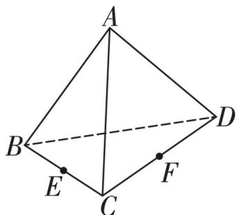

> [!faq]- 《专题01 空间向量及其运算高频题型精准突破（八大题型）（高效培优期末专项训练）》官方解析
>
> > [!success]- **【答案】**  A. $AB + BC + CD = AD$ B. $AB + BC - CD = DA$ C. $AB + \frac{1}{2} \left( BC + BD \right) = AF$ D. $AB - AE + EF = FB$
>
> > [!note]- **【分析】**
> > 根据空间向量的线性运算逐项分析即可得解·
>
> > [!note]- **【解析】**
> > 因为 $AB + BC + CD = AC + CD = AD$ ，故 A 正确；
> >
> > 因为 $AB + BC - CD = AC - CD = DC + AC \neq DA$ ，故 B 错误；
> >
> > 因为 $\overline{AB} + \frac{1}{2}\left(\overline{BC} + \overline{BD}\right) = \overline{AB} + \overline{BF} = \overline{AF}$ ，故 C 正确；
> >
> > 因为 $\overline{AB}-\overline{AE}+\overline{EF}=\overline{EB}+\overline{EF}\neq\overline{FB}$ ，故 D 错误.
> >
> > 故选 **AC**
