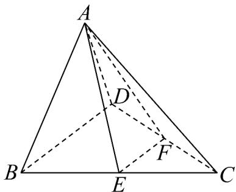

> [!faq]- 《专题01 空间向量及其运算高频题型精准突破（八大题型）（高效培优期末专项训练）》官方解析
>
> > [!success]- **【答案】**  A. $\frac{EF}{2}=\frac{1}{2}BD$ B. $AE+AF=AC$ C. $AD+DC+CB=AB$ D. $AD-\frac{1}{2}(AB+AC)=ED$
>
> > [!note]- **【分析】**
> > 根据空间向量的加法、减法及数乘运算化简即可逐项判断得解·
>
> > [!note]- **【解析】**
> > 因为 E，F 分别为 BC，CD 的中点，所以由中位线性质可知 $\overline{EF} = \frac{1}{2} \overline{BD}$ ，故 A 正确；
> > 若 $AE + AF = AC$ 可得 $AE = AC - AF = FC$ ，由图可知 $AE, FC$ 不共线，矛盾，故 B 错误；
> > 因为 $AD + DC + CB = AC + CB = AB$ ，故 C 正确；
> >
> > 因为 $AD - \frac{1}{2}(AB + AC) = AD - \frac{1}{2} \times 2AE = AD - AE = ED$ ，故 D 正确.
> >
> > 故选 **ACD**
