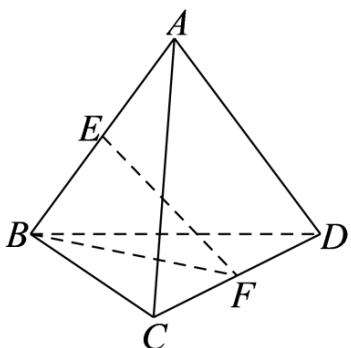

> [!faq]- 《专题01 空间向量及其运算高频题型精准突破（八大题型）（高效培优期末专项训练）》官方解析
>
> > [!success]- **【答案】** $\frac{1}{2}/0.5$
>
> > [!note]- **【分析】**
> > 用 $BA$ 、 $BC$ 、 $BD$ 表示 $EF$ ，结合空间向量数量积的运算性质可求得 $BC \cdot EF$ 的值
>
> > [!note]- **【解析】**
> > 如下图所示：
> >
> > 
> >
> > 由题意可得 $\overline{BA} \cdot \overline{BC} = \overline{BA} \cdot \overline{BD} = \overline{BC} \cdot \overline{BD} = 1^{2} \times \cos \frac{\pi}{3} = \frac{1}{2}$
> >
> > 因为 $E$ 、 $F$ 分别为 $AB$ 、 $CD$ 的中点，所以 $\overline{BE} = \frac{1}{2}\overline{BA}$ ， $\overline{BF} = \frac{1}{2}\left(\overline{BC} + \overline{BD}\right)$ ，
> >
> > $$
> > E F = B F - B E = \frac {1}{2} \left(B C + B D\right) - \frac {1}{2} B A = \frac {1}{2} \left(B C + B D - B A\right)
> > $$
> >
> > 因此， $BC \cdot EF = \frac{1}{2} BC \cdot \left( BC + BD - BA \right) = \frac{1}{2} \left( BC^{2} + BC \cdot BD - BA \cdot BC \right)$
> >
> > $$
> > = \frac {1}{2} \times \left(1 ^ {2} + \frac {1}{2} - \frac {1}{2}\right) = \frac {1}{2}.
> > $$
> >
> > 故答案为： $\frac{1}{2}$
