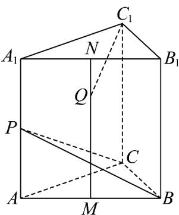
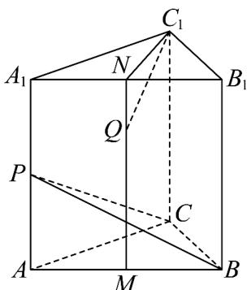

> [!faq]- 《专题01 空间向量及其运算高频题型精准突破（八大题型）（高效培优期末专项训练）》官方解析
>
> > [!success]- **【答案】**  A. 直线 $C_{1}Q$ 与直线 $AB$ 始终垂直 B. 直线 $C_{1}Q$ 与直线 $CP$ 始终异面 C. 直线 $C_{1}Q$ 与直线 $CP$ 可能垂直 D. 直线 $C_{1}Q$ 与直线 $BP$ 可能垂直
>
> > [!note]- **【分析】**
> > 证明 $MN//$ 平面 $AA_{1}C_{1}C$ ，从而可证 $C_{1},P,C,Q$ 四点不共面，即可判断 ${}^{AB}$ ；设 $NQ = \lambda MN(0 \leq \lambda \leq 1)$ ，将 $QC_{1},CP$ 分别用 $AA_{1},AC,AB$ 表示，假设直线 $C_{1}Q$ 与直线 $CP$ 垂直，则 $QC_{1} \cdot CP = 0$ ，求出 $\lambda$ 即可判断 ${}^{C}$ ；证明 $C_{1}N \perp$ 平面 $ABB_{1}A_{1}$ ，即可判断 ${}^{D}$ .
>
> > [!note]- **【解析】**
> > 对于 $^{A}$ ，连接CM
> >
> > 因为正三棱柱 $ABC - A_{1}B_{1}C_{1}$ 的所有棱长均为1，点 $P$ 、 $M$ 、 $N$ 分别为棱 $AA_{1}$ 、 $AB$ 、 $A_{1}B_{1}$ 的中点，所以 $CM\perp AB$ ， $AA_{1}\perp$ 平面 $ABC$ 又因 $AA_{1}\perp$ 平面 $A_{1}B_{1}C_{1}$ ， $AB\subset$ 平面 $ABC$ ，所以 $AA_{1}\perp AB$ ，
> >
> > 因为 $CM \cap AB = M, CM, AB \subset$ 平面 $CMNC_{1}$
> >
> > 所以 $AB \perp$ 平面 $CMNC_{1}$
> >
> > 又 $C_{1}Q \subset$ 平面 $CMNC_{1}$ ，所以 $C_{1}Q \perp AB$ ，
> >
> > 故 $^{A}$ 正确·
> >
> > 在正三棱柱 $ABC-A_{1}B_{1}C_{1}$ 中，
> >
> > 因为点 M、N 分别为棱 AB、 $A_{1}B_{1}$ 的中点，所以 $MN//AA_{1}$ ，
> >
> > 又 $MN \notin$ 平面 $AA_{1}C_{1}C$ ， $AA_{1} \subset$ 平面 $AA_{1}C_{1}C$
> >
> > 所以 $MN \parallel$ 平面 $AA_{1}C_{1}C$
> >
> > 因为 $C_{1}, P, C \in$ 平面 $AA_{1}C_{1}C$ ， $C_{1} \notin PC$ ， $Q \in MN$ ，
> >
> > 所以 $C_1, P, C, Q$ 四点不共面，
> >
> > 所以直线 $C_{1}Q$ 与直线 CP 始终异面，故 B 正确；
> >
> > 对于 C，设 $NQ = \lambda MN (0 \leq \lambda \leq 1)$
> >
> > $$
> > Q C _ {1} = Q N + N C _ {1} = \lambda M N + N A _ {1} + A _ {1} C _ {1} = \lambda A A _ {1} + A C - \frac {1}{2} A B
> > $$
> >
> > $CP=\frac{1}{2}AA_{1}-AC$
> >
> > 若直线 $C_{1}Q$ 与直线 CP 垂直，则 $\overline{QC}_{1} \cdot \overline{CP} = 0$
> >
> > 即 $\left(\lambda AA_{1}+AC-\frac{1}{2}AB\right)\cdot\left(\frac{1}{2}AA_{1}-AC\right)=0$ ，
> >
> > 所以 $\frac{\lambda}{2} AA_{1}^{2}-\lambda AA_{1}\cdot AC+\frac{1}{2} AA_{1}\cdot AC-AC^{2}-\frac{1}{4} AA_{1}\cdot AB+\frac{1}{2} AB\cdot AC=0$
> >
> > 即 $\frac{\lambda}{2} - 1 + \frac{1}{2} \times 1 \times 1 \times \frac{1}{2} = 0$ ，解得 $\lambda = \frac{3}{2}$ ，
> >
> > 因为 $0 \leq \lambda \leq 1$ ，所以不存在点 Q 使得直线 $C_{1}Q$ 与直线 CP 垂直，故 C 错误；
> >
> > 对于 D，连接 $C_{1}N$ ，
> >
> > 因为 $C_{1}A_{1}=C_{1}B_{1},N$ 为 $A_{1}B_{1}$ 的中点，所以 $C_{1}N\perp A_{1}B_{1}$
> >
> > 又因 $AA_{1} \perp$ 平面 $A_{1}B_{1}C_{1}$ ， $C_{1}N \subset$ 平面 $A_{1}B_{1}C_{1}$ ，
> >
> > 所以 $AA_{1} \perp C_{1}N$
> >
> > 因为 $AA_{1} \cap A_{1}B_{1} = A_{1}, AA_{1}, A_{1}B_{1} \subset$ 平面 $ABB_{1}A_{1}$
> >
> > 所以 $C_1N \perp$ 平面 $ABB_{1}A_{1}$
> >
> > 又 $BP \subset$ 平面 $ABB_{1}A_{1}$ ，所以 $C_{1}N \perp BP$ ，
> >
> > 所以当点 $Q$ 在 $N$ 的位置时，直线 $C_1Q$ 与直线 $BP$ 垂直，故 $\mathsf{D}$ 正确·
> >
> > 
> >
> > 故选 **C**.
