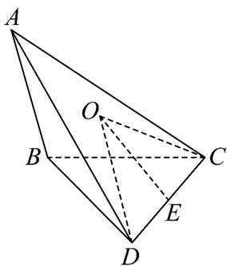
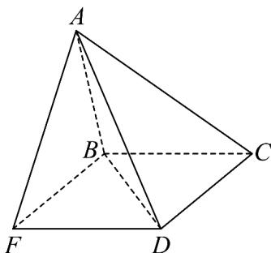
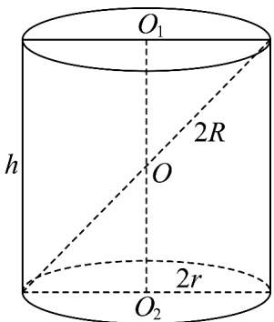
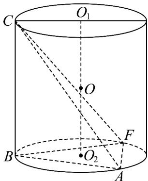

> [!faq]- 《专题01 空间向量及其运算高频题型精准突破（八大题型）（高效培优期末专项训练）》官方解析
>
> > [!success]- **【答案】** A．若 $AB \perp CD$ ，则 $AB \perp$ 平面 $BCD$ B．若 $AB = CD = 1$ ，则 $AD$ 的取值范围是 $(2, 2\sqrt{2})$ C．若 $AB + CD = 2$ ，则 $\overline{CO} \cdot (\overline{CD} - \overline{BA})$ 的取值范围是 $(-2, 2)$ D．若 $AB = CD = 2$ ，直线 $AB$ 与 $CD$ 所成的角为 $60^\circ$ ，则四面体 $ABCD$ 外接球的表面积为 $\frac{28}{3}\pi$
>
> > [!note]- **【分析】**
> > 利用线面垂直的判定定理可判断 A 选项；由 $AD = AB + BC + CD$ 结合空间向量数量积的运算性质可判断 B 选项；利用空间向量数量积的运算性质可判断 C 选项；以 BC、CD 为邻边作平行四边形 BCDF，则 BCDF 为矩形，分 $\angle ABF = 60^{\circ}$ 、 $\angle ABF = 120^{\circ}$ 两种情况求出球 O 的表面积，可判断 D 选项。
>
> > [!note]- **【解析】**
> > 对于 A 选项，若 $AB \perp CD$ ，又因为 $AB \perp BC$ ， $BC \cap CD = C$ ，
> >
> > BC、CD ⊂ 平面 BCD，故 $AB \perp$ 平面 BCD，A 对；
> >
> > 对于 B 选项， $AD = AB + BC + CD$ ，由题意 $AB \cdot BC = BC \cdot CD = 0$ ，
> >
> > 所以 $AD^{2} = (AB + BC + CD)^{2} = AB^{2} + BC^{2} + CD^{2} + 2(AB \cdot BC + BC \cdot CD + AB \cdot CD)$ $= 6 + 2AB \cdot CD = 6 + 2|AB| \cdot |CD| \cos AB, CD = 6 + 2\cos AB, CD$ ，
> >
> > 因为 AB、CD 互为异面直线，则 $AB, CD \in (0, \pi)$ ，
> >
> > 故 $AD^{2} = 6 + 2\cos AB, CD \in (4, 8)$ ，故 $2 < |AD| < 2\sqrt{2}$ ，B 对；
> >
> > 对于 C 选项，不妨取 CD 的中点 E，连接 OE、OD，则 OE ⊥ CD， $CO \cdot CD = (CE + EO) \cdot CD = CE \cdot CD + EO \cdot CD = \frac{1}{2}CD^{2}$
> >
> > 
> >
> > 同理可得 $\overset{\square\square}{CO}\cdot\overset{\square\square}{CA}=\frac{1}{2}\overset{\square\square}{CA}^{2},\quad\overset{\square\square}{CO}\cdot\overset{\square\square}{CB}=\frac{1}{2}\overset{\square\square}{CB}^{2}$
> >
> > 所以， $CO\cdot\left(CD-BA\right)=CO\cdot\left(CD+AB\right)=CO\cdot\left(CD+CB-CA\right)$
> >
> > $$
> > = \frac {1}{2} \left(C D ^ {2} + C B ^ {2} - C A ^ {2}\right) = \frac {1}{2} \left(C D ^ {2} + B C ^ {2} - A C ^ {2}\right) = \frac {1}{2} \left(C D ^ {2} - A B ^ {2}\right)
> > $$
> >
> > $$
> > = \frac {1}{2} (C D - A B) (C D + A B) = C D - A B = C D - (2 - C D) = 2 C D - 2
> > $$
> >
> > 因为 $AB + CD = 2$ ，故 0 < CD < 2，故 $\overline{CO} \cdot (\overline{CD} - \overline{BA}) = 2CD - 2 \in (-2, 2)$ ，C 对；
> > 对于 D 选项，以 BC、CD 为邻边作平行四边形 BCDF，则 ABCDF 为矩形，
> > 故 A-BCDF 的各顶点都在球 O 的球面上，如下图所示：
> >
> > 
> >
> > 则 $BF \perp BC$ ，又因为 $BC \perp AB$ ， $AB \cap BF = B$ ， $AB$ 、 $BF \subset$ 平面 $ABF$ ，所以， $BC \perp$ 平面 $ABF$ ，且 $BF = CD = 2$ ，
> >
> > 如下图所示：
> >
> > <!-- source-part:2 pages:51-55 -->
> >
> > 
> >
> > 圆柱 $O_{1}O_{2}$ 的底面圆直径为 $2r$ ，母线长为 $h$ ，则 $O_{1}O_{2}$ 的中点 $O$ 到圆柱底面圆上每点的距离都相等，则 $O$ 为圆柱 $O_{1}O_{2}$ 的外接球球心.
> >
> > 可将三棱锥 C-ABF 置于圆柱 $O_{1}O_{2}$ 内，使得 $\triangle ABF$ 的外接圆为圆 $O_{2}$ ，如下图所示：
> >
> > 
> >
> > 因为 $CD // BF$ ，故异面直线 $AB$ 、 $CD$ 所成的角为 $\angle ABF$ 或其补角，
> >
> > 当 $\angle ABF = 60^{\circ}$ 时， $\triangle ABF$ 为等边三角形，则该三角形外接圆直径为 $2r = \frac{2}{\sin\frac{\pi}{3}} = \frac{4\sqrt{3}}{3}$ ，
> >
> > 设球 O 的半径为 $_{R}$ ，则 $(2R)^{2}=(2r)^{2}+BC^{2}=\frac{16}{3}+4=\frac{28}{3}$ ，
> >
> > 此时，球 O 的表面积为 $4\pi R^{2} = \frac{28\pi}{3}$ ;
> >
> > 当 $\angle ABF = 120^{\circ}$ 时，由于 $AB = BF = 2$ ，则 $\angle AFB = 30^{\circ}$
> >
> > 则 $\triangle ABF$ 外接圆直径为 $2r = \frac{2}{\sin 30^{\circ}} = 4$ ，则 $(2R)^{2} = (2r)^{2} + BC^{2} = 16 + 4 = 20$
> >
> > 此时，球 O 的表面积为 $4\pi R^{2} = 20\pi$ .
> >
> > 综上所述，球 $O$ 的表面积为 $\frac{28\pi}{3}$ 或 $20\pi$ ，D错·
> >
> > 故选 **ABC**.
