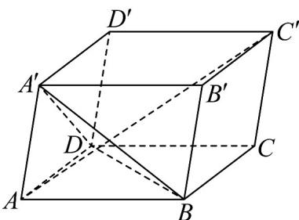

<!-- question-source:start -->
18. 如图，在平行六面体 $ABCD - A'B'C'D'$ 中， $\angle BAD = \angle BAA' = \angle DAA'$ ， $AB = AD = AA' = 2$ 。设 $AB = a$ ， $AD = b$ ， $AA' = c$ 。

(1)用基底 $\left\{\begin{array}{cc}r & r \\ a,b,c\end{array}\right\}$ 表示向量 $\stackrel{uuu}{BD}$ ， $\stackrel{uuu}{BA'}$ ， $\stackrel{uuuu}{AC'}$ ；

(2)证明： $AC' \perp$ 平面 $A^{\prime}BD$
<!-- question-source:end -->

![[高中/课堂同步/题库/人教A版高中数学同步讲义(2026)/04_选择性必修第二册/期末/专题02 空间向量基本定理高频题型精准突破（三大题型）（高效培优期末专项训练）/专题02_空间向量基本定理_三大题型/questions/answers/Q00080923A1.md]]
