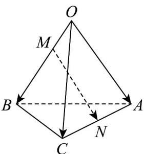

<!-- question-source:start -->
29. 如图，在四面体 $OABC$ 中， $OA = a, OB = b, OC = c \cdot$ 点 $M$ 在 $OB$ 上，且 $OM = \frac{1}{2} MB$ ，点 $N$ 是 $AC$ 的中点，则 $MN = (\quad)$

A. $\frac{1}{2} a - \frac{1}{3} b + \frac{1}{2} c$ B. $-\frac{1}{2} a + \frac{1}{3} b - \frac{1}{2} c$ C. $\frac{1}{2} a - \frac{2}{3} b + \frac{1}{2} c$ D. $-\frac{1}{2} a + \frac{2}{3} b - \frac{1}{2} c$
<!-- question-source:end -->

![[高中/课堂同步/题库/人教A版高中数学同步讲义(2026)/04_选择性必修第二册/期末/专题02 空间向量基本定理高频题型精准突破（三大题型）（高效培优期末专项训练）/专题02_空间向量基本定理_三大题型/questions/answers/Q00080934A1.md]]
