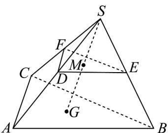

<!-- question-source:start -->
34. 如图，在三棱锥 $S - ABC$ 中，点 $G$ 为底面 $\triangle ABC$ 的重心，点 $M$ 是线段 $SG$ 的中点，过点 $M$ 的平面分别

交 $SA$ ， $SB$ ， $SC$ 于点 $D$ ， $E$ ， $F$ ，若 $\overline{SD} = k\overline{SA}$ ， $\overline{SE} = m\overline{SB}$ ， $\overline{SF} = n\overline{SC}$ ，则 $\frac{1}{k} +\frac{1}{m} +\frac{1}{n} = (\quad)$

A.3 B.6 C.9 D.12
<!-- question-source:end -->

![[高中/课堂同步/题库/人教A版高中数学同步讲义(2026)/04_选择性必修第二册/期末/专题02 空间向量基本定理高频题型精准突破（三大题型）（高效培优期末专项训练）/专题02_空间向量基本定理_三大题型/questions/answers/Q00080939A1.md]]
