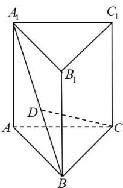

<!-- question-source:start -->
39. 如图，在直三棱柱 $ABC - A_{1}B_{1}C_{1}$ 中， $AB = AC = AA_{1} = 3$ ， $\angle BAC = \frac{\pi}{3}$ ， $\overline{BD} = \frac{1}{3} BA_{1}$ .

(1)用 $AB, AC, AA_{1}$ 表示 $CD$ ；

(2)求直线 CD 与直线 $AC_{1}$ 所成角的余弦值.
<!-- question-source:end -->

![[高中/课堂同步/题库/人教A版高中数学同步讲义(2026)/04_选择性必修第二册/期末/专题02 空间向量基本定理高频题型精准突破（三大题型）（高效培优期末专项训练）/专题02_空间向量基本定理_三大题型/questions/answers/Q00080943A1.md]]
