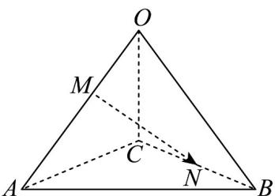

<!-- question-source:start -->
45. 已知四面体 $OABC$ 中， $\overline{OA} = a$ ， $\overline{OB} = b$ ， $\overline{OC} = c$ ， $\overline{OM} = \lambda MA (\lambda > 0)$ ， $N$ 为 $BC$ 中点，若 $\overline{MN} = -\frac{1}{4}a + \frac{1}{2}b + \frac{1}{2}c$ ，则 $\lambda = (\quad)$

A. 3 B. 2 C. $\frac{1}{2}$ D. $\frac{1}{3}$
<!-- question-source:end -->

![[高中/课堂同步/题库/人教A版高中数学同步讲义(2026)/04_选择性必修第二册/期末/专题02 空间向量基本定理高频题型精准突破（三大题型）（高效培优期末专项训练）/专题02_空间向量基本定理_三大题型/questions/answers/Q00080946A1.md]]
