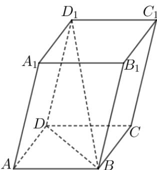

> [!faq]- 《专题02 空间向量基本定理高频题型精准突破（三大题型）（高效培优期末专项训练）》官方解析
>
> > [!success]- **【答案】** $\frac{5}{6}$
>
> > [!note]- **【分析】**
> > 利用平行六面体的结构特征确定异面直线所成的角，再借助空间向量数量积的运算律求出 $BD_{1}$ ，进而利用余弦定理求得答案：
>
> > [!note]- **【解析】**
> > 在平行六面体 $ABCD-A_{1}B_{1}C_{1}D_{1}$ 中， $CC_{1}//DD_{1}$
> >
> > 则 $\angle BD_{1}D$ 是异面直线 $BD_{1}$ 与 $CC_{1}$ 所成角或其补角，
> >
> > $$
> > \angle A _ {1} A B = \angle A _ {1} A D = \angle B A D = \frac {\pi}{3}, A B = 1, A D = A A _ {1} = 2
> > $$
> >
> > $$
> > B D = \sqrt {A B ^ {2} + A D ^ {2} - 2 A B \cdot A D \cos \angle B A D} = \sqrt {3}
> > $$
> >
> > $$
> > B D _ {1} = A D _ {1} - A B = A A _ {1} + A D - A B
> > $$
> >
> > $$
> > \left| \begin{array}{c} \square \square \square \\ B D _ {1} \end{array} \right| = \sqrt {\square \square \square_ {2} + A D ^ {2} + A B ^ {2} + 2 A A _ {1} \cdot A D - 2 A D \cdot A B - 2 A B \cdot A A _ {1}}
> > $$
> >
> > $$
> > = \sqrt {2 ^ {2} + 2 ^ {2} + 1 ^ {2} + 2 \times 2 \times 2 \times \frac {1}{2} - 2 \times 2 \times 1 \times \frac {1}{2} - 2 \times 1 \times 2 \times \frac {1}{2}} = 3
> > $$
> >
> > 在 $\triangle BDD_{1}$ 中， $\cos \angle BD_{1}D = \frac{BD_{1}^{2} + DD_{1}^{2} - BD^{2}}{2BD_{1} \cdot DD_{1}} = \frac{3^{2} + 2^{2} - (\sqrt{3})^{2}}{2 \times 3 \times 2} = \frac{5}{6}$ .
> >
> > 
> >
> > 故答案为： $\frac{5}{6}$
