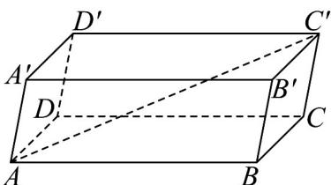

> [!faq]- 《专题02 空间向量基本定理高频题型精准突破（三大题型）（高效培优期末专项训练）》官方解析
>
> > [!success]- **【答案】** B
>
> > [!note]- **【分析】**
> > 由空间向量基本定理，用 $\overline{SA},\overline{SB},\overline{SC}$ 表示 $\overline{SM}$ ，由D，E，F，M四点共面，可得存在实数 $\lambda,\mu$ 使 $\overline{DM}=\lambda\overline{DE}+\mu\overline{DF}$ ，再转化为 $\overline{SM}=(1-\lambda-\mu)k\overline{SA}+\lambda m\overline{SB}+\mu n\overline{SC}$ ，由空间向量分解的唯一性，列方程求其解可得结论：
>
> > [!note]- **【解析】**
> > 由题意可知，
> >
> > $$
> > \stackrel {\square \square \square} {S M} = \frac {1}{2} \stackrel {\square \square \square} {S G} = \frac {1}{2} \left(\stackrel {\square \square} {S A} + \stackrel {\square \square \square} {A G}\right) = \frac {1}{2} \left[ \stackrel {\square \square} {S A} + \frac {2}{3} \times \frac {1}{2} \left(\stackrel {\square \square \square} {A B} + \stackrel {\square \square \square} {A C}\right) \right]
> > $$
> >
> > $$
> > = \frac {1}{2} \left[ \stackrel {\square \square} {S A} + \frac {1}{3} \left(\stackrel {\square \square} {S B} - \stackrel {\square \square} {S A}\right) + \frac {1}{3} \left(\stackrel {\square \square \square} {S C} - \stackrel {\square \square} {S A}\right) \right] = \frac {1}{6} \stackrel {\square \square} {S A} + \frac {1}{6} \stackrel {\square \square} {S B} + \frac {1}{6} \stackrel {\square \square \square} {S C}
> > $$
> >
> > 因为 $D$ ， $E$ ， $F$ ， $M$ 四点共面，
> >
> > 所以存在实数 $\lambda, \mu$ ，使 $DM = \lambda DE + \mu DF$
> >
> > 所以 $\overline{SM}-\overline{SD}=\lambda\left(\overline{SE}-\overline{SD}\right)+\mu\left(\overline{SF}-\overline{SD}\right)$
> >
> > 所以
> >
> > $$
> > \stackrel {\mathrm{uu}} {S M} = \left(1 - \lambda - \mu\right) \stackrel {\mathrm{uu}} {S D} + \lambda \stackrel {\mathrm{uu}} {S E} + \mu \stackrel {\mathrm{uu}} {S F} = \left(1 - \lambda - \mu\right) k \stackrel {\mathrm{uu}} {S A} + \lambda m \stackrel {\mathrm{uu}} {S B} + \mu n \stackrel {\mathrm{uu}} {S C}
> > $$
> >
> > 所以
> >
> > $\left\{ \begin{array}{l} (1 - \lambda - \mu)k = \frac{1}{6} \\ \lambda m = \frac{1}{6} \\ \mu n = \frac{1}{6} \end{array} \right.$ ，所以
> >
> > 故选：B.
> >
> > 35. 平行六面体 $ABCD - A'B'C'D'$ ，其中 $AB = 4$ ， $AD = 3$ ， $AA' = 3$ ， $\angle BAD = 90^\circ$ ， $\angle BAA' = 60^\circ$ ， $\angle DAA' = 60^\circ$ ，则 $AC'$ 的长为（）
> >
> > 【答案】
> >
> > A. $\sqrt{55}$ B. $\sqrt{65}$ C. $\sqrt{85}$ D. $\sqrt{95}$
> >
> > 【答案】A
> >
> > 【分析】用空间向量基本定理表示出 $AC'$ ，然后平方后转化为数量积的运算求得。
> >
> > 【详解】解：如图，
> >
> > 
> >
> > 可得 $AC' = AB + BC + CC' = AB + AD + AA'$ 故 $|AC'|^2 = (AB + AD + AA')^2$ $= |AB|^2 + |AD|^2 + |AA'|^2 + 2(AB \cdot AD + AB \cdot AA' + AD \cdot AA') = 4^2 + 3^2 + 3^2 + 2\left(4 \times 3 \times 0 + 4 \times 3 \times \frac{1}{2} + 3 \times 3 \times \frac{1}{2}\right) = 55$ $\therefore AC' = \sqrt{55}$
> >
> > 故选 **A**
