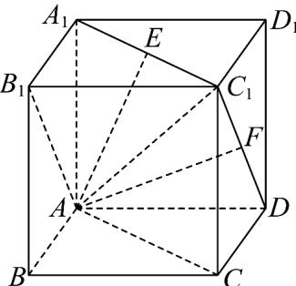

> [!faq]- 《专题02 空间向量基本定理高频题型精准突破（三大题型）（高效培优期末专项训练）》官方解析
>
> > [!success]- **【答案】** AC
>
> > [!note]- **【分析】**
> > 根据空间向量共面定理判断 AC，根据空间向量基本定理求得 x, y 值判断 BD。
>
> > [!note]- **【解析】**
> > 对于 A，正方体中， $AD = B'C'$ ， $AD // B'C'$ ，四边形 $ADC'B'$ 为平行四边形， $AF, AD, AB'$ ， $AC'$ 都在平面 $ADC'B'$ 内，
> >
> > 所以对于任意的 $x, y$ ，都有 $AF, AD, xAB' + yAC'$ 共面，故 $\mathsf{A}$ 正确；
> >
> > 对于 B, $AE = AA' + A'E = AA' + \frac{1}{2} AC = AA' + \frac{1}{2} AB + \frac{1}{2} AD$ ，故 x = y = $\frac{1}{2}$ ，故 B 错误；
> >
> > 对于 $C, AF = \frac{1}{2} AD + \frac{1}{2} AC'$ ，则 $x = \frac{1}{2}, y = 0$ 时， $AF, AD, xAC' + yAC$ 共面，故 $C$ 正确；
> >
> > 对于 $^{D}$ ， $AC' = AC + CC' = AB + BC + CC'$ ，得 x = 1，故 $^{D}$ 错误。
> >
> > 故选：AC.
> >
> > 
