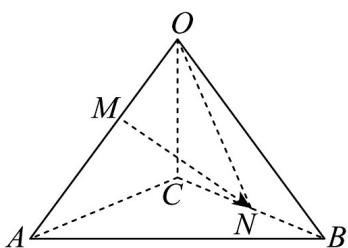

> [!faq]- 《专题02 空间向量基本定理高频题型精准突破（三大题型）（高效培优期末专项训练）》官方解析
>
> > [!success]- **【答案】** D
>
> > [!note]- **【分析】**
> > 根据空间向量的运算法则，化简得到 $\overline{MN} = -\frac{\lambda}{1 + \lambda} a + \frac{1}{2} b + \frac{1}{2} c$ ，结合题意，列出方程，即可求解。
>
> > [!note]- **【解析】**
> > 因为 $\overline{OM} = \lambda \overline{MA} (\lambda > 0)$ ，所以 $\overline{OM} = \frac{\lambda}{1 + \lambda} OA$ ，
> >
> > 
> >
> > 依题意可得 $MN = ON - OM$
> >
> > $$
> > = \frac {1}{2} \left(O B + O C\right) - \frac {\lambda}{1 + \lambda} O A = - \frac {\lambda}{1 + \lambda} a + \frac {1}{2} b + \frac {1}{2} c
> > $$
> >
> > 因为 $\overline{MN} = -\frac{1}{4}a + \frac{1}{2}b + \frac{1}{2}c$ ，所以 $\frac{\lambda}{1 + \lambda} = \frac{1}{4}$ ，解得 $\lambda = \frac{1}{3}$ .
> >
> > 故选 **D**.
