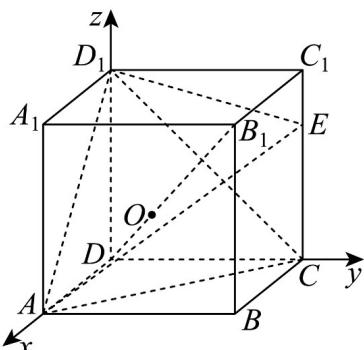

> [!faq]- 《专题03 空间向量及其运算的坐标表示高频题型精准突破（五大题型）（高效培优期末专项训练）》官方解析
>
> > [!success]- **【答案】** A. $\frac{\sqrt{16}}{3}$ B. $\frac{\sqrt{17}}{3}$ C. $\frac{\sqrt{21}}{3}$ D. $\frac{\sqrt{22}}{3}$
>
> > [!note]- **【分析】**
> > 建立空间直角坐标系，设 $CE = m(0 < m < 1)$ ，三棱锥 $D_{1} - AEC$ 的外接球球心为 $O(x,y,z)$ ，外接球半径为 $r$ ，利用 $r = OA = OC = OD_{1} = OE$ 得到 $x = y = z = \frac{1}{2}m$ ，根据 $r$ 最小时 $x$ 的值即可得到 $E$ 的坐标即可求出 $AE$ . 【详解】以 $D$ 为坐标原点， $DA,DC,DD_{1}$ 所在直线分别为 $x,y,z$ 轴，建立如图所示空间直角坐标系。设 $CE = m(0 < m < 1)$ ，则 $A(1,0,0),C(0,1,0),D_{1}(0,0,1),E(0,1,m)$ 。设三棱锥 $D_{1} - AEC$ 的外接球球心为 $O(x,y,z)$ ，外接球半径为 $r$ ，则 $r = OA = OC = OD_{1} = OE$ ，即 $\sqrt{(x - 1)^2 + y^2 + z^2} = \sqrt{x^2 + (y - 1)^2 + z^2} = \sqrt{x^2 + y^2 + (z - 1)^2} = \sqrt{x^2 + (y - 1)^2 + (z - m)^2}$ ，化简得 $x = y = z = \frac{1}{2}m$ ，则 $r = \sqrt{(x - 1)^2 + x^2 + x^2} = \sqrt{3x^2 - 2x + 1} = \sqrt{3\left(x - \frac{1}{3}\right)^2 + \frac{2}{3}}$ ，当 $x = \frac{1}{3}$ 时， $r$ 最小，此时 $m = 2x = \frac{2}{3}$ ，即 $E\left(0,1,\frac{2}{3}\right)$ ，所以 $AE = \sqrt{1 + 1 + \frac{4}{9}} = \frac{\sqrt{22}}{3}$ 。故选：D
>
> > [!note]- **【解析】**
> > 
