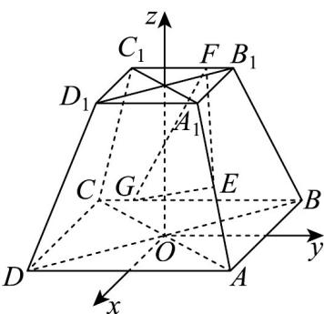

> [!faq]- 《专题03 空间向量及其运算的坐标表示高频题型精准突破（五大题型）（高效培优期末专项训练）》官方解析
>
> > [!success]- **【答案】** 
>
> > [!note]- **【分析】**
> > 根据已知构建合适的空间直角坐标系，得 $E(\frac{3}{2},\frac{3}{2},\frac{3}{2})$ ， $F(-1,f,3)$ ， $G(-2,g,0)$ 且 $-1\leq f\leq1$ ， $-2\leq g\leq2$ ，由已知及向量数量积的坐标运算得 $fg=\frac{3}{2}(f+g)-\frac{5}{2}$ ，结合向量模长的坐标运算得 $\left|FG\right|=\sqrt{\left[(g+f)-3\right]^{2}+11}$ ，且 $-3\leq g+f\leq3$ ，即可求最值·
>
> > [!note]- **【解析】**
> > 设 O 为下底面中心，构建如下图示的空间直角坐标系 O - xyz
> >
> > 结合题设知 $E\left(\frac{3}{2}, \frac{3}{2}, \frac{3}{2}\right)$ ， $F(-1, f, 3)$ ， $G(-2, g, 0)$ 且 $-1 \leq f \leq 1$ ， $-2 \leq g \leq 2$ ，
> >
> > 所以 $EF = \left(-\frac{5}{2}, f - \frac{3}{2}, \frac{3}{2}\right)$ ， $EG = \left(-\frac{7}{2}, g - \frac{3}{2}, -\frac{3}{2}\right)$ ，故 $EF \cdot EG = \frac{35}{4} + \left(f - \frac{3}{2}\right) \left(g - \frac{3}{2}\right) - \frac{9}{4} = \frac{25}{4}$ ，
> > 所以 $\left(f-\frac{3}{2}\right)\left(g-\frac{3}{2}\right)=-\frac{1}{4}$ ，可得 $fg=\frac{3}{2}(f+g)-\frac{5}{2}$
> >
> > 而 $\overline{FG} = (-1, g - f, -3)$ ，则 $\left|\overline{FG}\right| = \sqrt{(g - f)^2 + 10} = \sqrt{(g + f)^2 - 4gf + 10} = \sqrt{(g + f)^2 - 6(f + g) + 20}$ $= \sqrt{\left[\left(g + f\right) - 3\right]^2 + 11}$
> >
> > 又 $-3 \leq g + f \leq 3$ ，故 $g + f = 3$ 时， $|FG|_{\min} = \sqrt{11}$ 。
> >
> > 故答案为： $\sqrt{11}$
> >
> > 
