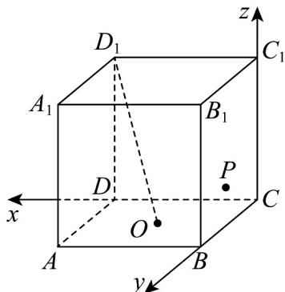
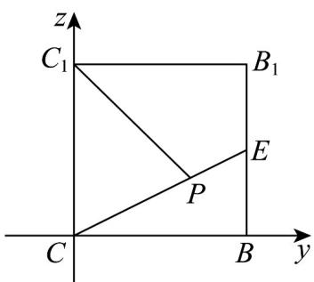

> [!faq]- 《专题03 空间向量及其运算的坐标表示高频题型精准突破（五大题型）（高效培优期末专项训练）》官方解析
>
> > [!success]- **【答案】**  A. 2 B. $\frac{4\sqrt{5}}{5}$ C. $2\sqrt{2}$ D. $\sqrt{5}$
>
> > [!note]- **【分析】**
> > 通过建立空间直角坐标系，设 P 坐标，根据 $D_{1}O \perp OP$ 可得出轨迹方程，再根据轨迹方程即可求解.
>
> > [!note]- **【解析】**
> > 如图，以 $C$ 为原点建立空间直角坐标系，设 $P(0,y,z)$
> >
> > 
> >
> > $D_{1}(2,0,2)\quad O(1,1,0)\quad \stackrel{\square\square\square\square}{D_{1}O} = (-1,1,-2)\quad \stackrel{\square\square\square}{OP} = (-1,y - 1,z)$
> >
> > $$
> > \because D _ {1} O \perp O P, \therefore D _ {1} O \cdot O P = (- 1, 1, - 2) \cdot (- 1, y - 1, z) = y - 2 z = 0
> > $$
> >
> > ∴点 P 在侧面 $BB_{1}C_{1}C$ 的边界及其内部运动的轨迹如图线段 CE :
> >
> > 
> >
> > 正方体 $ABCD - A_{1}B_{1}C_{1}D_{1}$ 中， $C_{1}D_{1} \perp$ 平面 $BB_{1}C_{1}C$
> >
> > $\therefore C_{1}D_{1}\perp C_{1}P$ ，又 $S_{\triangle D_1C_1P} = \frac{1}{2} D_1C_1\cdot C_1P = C_1P$
> >
> > 由图可知当点 $P$ 在 $E$ 处 $C_1P$ 取得最大值 $\sqrt{5}$
> >
> > 所以 $\triangle D_{1}C_{1}P$ 面积的最大值 $\sqrt{5}$
> >
> > 故选 **D**.
