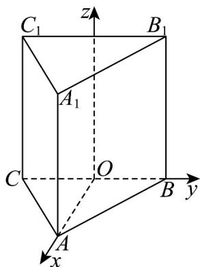
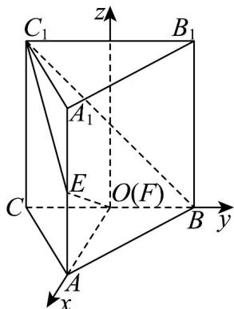

> [!faq]- 《专题03 空间向量及其运算的坐标表示高频题型精准突破（五大题型）（高效培优期末专项训练）》官方解析
>
> > [!success]- **【答案】** (1)答案见解析 (2) $EC_{1} = \left(-\sqrt{3}, - 1, \frac{3}{2}\right), EF = \left(-\sqrt{3},0, - \frac{3}{2}\right)$ (3) $-\frac{\sqrt{13}}{5}$
>
> > [!note]- **【分析】**
> > （1）以 BC 的中点 O 为原点，以 $^{1}$ 为单位长度，建立空间直角坐标系，再写出各点的坐标即可；
> >
> > (2) 写出 E, F 的坐标，再根据向量的坐标表示即可得解；
> >
> > (3) 根据 $\cos EC_{1}, C_{1}B = \frac{EG_{1} \cdot C_{1}B}{|EC_{1}| |C_{1}B|}$ 计算即可.
>
> > [!note]- **【解析】**
> > （1）以 $BC$ 的中点 $O$ 为原点，以1为单位长度，建立空间直角坐标系，如图所示：
> >
> > 
> >
> > 由题意知， $\left|AO\right|=\sqrt{3}$
> >
> > 则 $A(\sqrt{3},0,0)$ ， $B(0,1,0)$ ， $C(0, - 1,0)$ ， $A_{1}(\sqrt{3},0,3)$ ， $B_{1}(0,1,3)$ ， $C_1(0, - 1,3)$
> >
> > (2) 由题意知， $E\left(\sqrt{3},0,\frac{3}{2}\right),F(0,0,0)$
> >
> > 故 $\overline{EC_{1}}=\left(-\sqrt{3},-1,\frac{3}{2}\right),\overline{EF}=\left(-\sqrt{3},0,-\frac{3}{2}\right)$ ;
> >
> > 
> >
> > (3) $C_1B = (0,2, - 3)$
> >
> > 所以 $\cos EC_{1}, C_{1}B = \frac{EC_{1} \cdot C_{1}B}{|EC_{1}| |C_{1}B|} = \frac{0 - 2 - \frac{9}{2}}{\sqrt{3 + 1 + \frac{9}{4}} \times \sqrt{0 + 4 + 9}} = -\frac{\sqrt{13}}{5}$ .
