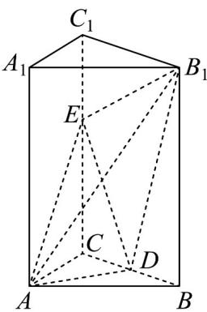

<!-- question-source:start -->
11. 如图，正三棱柱 $ABC - A_{1}B_{1}C_{1}$ 中， $AB = 2$ ， $AA_{1} = 3$ ， $D$ 是 $BC$ 中点， $E$ 是棱 $CC_{1}$ 上一点。

(1)求证： $AD\perp$ 平面 $BCC_{1}B_{1}$

(2)若平面 $B_{1}EA\perp$ 平面 $ADE$ ，求 $CE$ 的长.
<!-- question-source:end -->

![[高中/课堂同步/题库/人教A版高中数学同步讲义(2026)/04_选择性必修第二册/期末/专题04 空间向量的应用高频题型精准突破（五大题型）（高效培优期末专项训练）/专题04_空间向量的应用_五大题型/questions/answers/Q00081005A1.md]]
